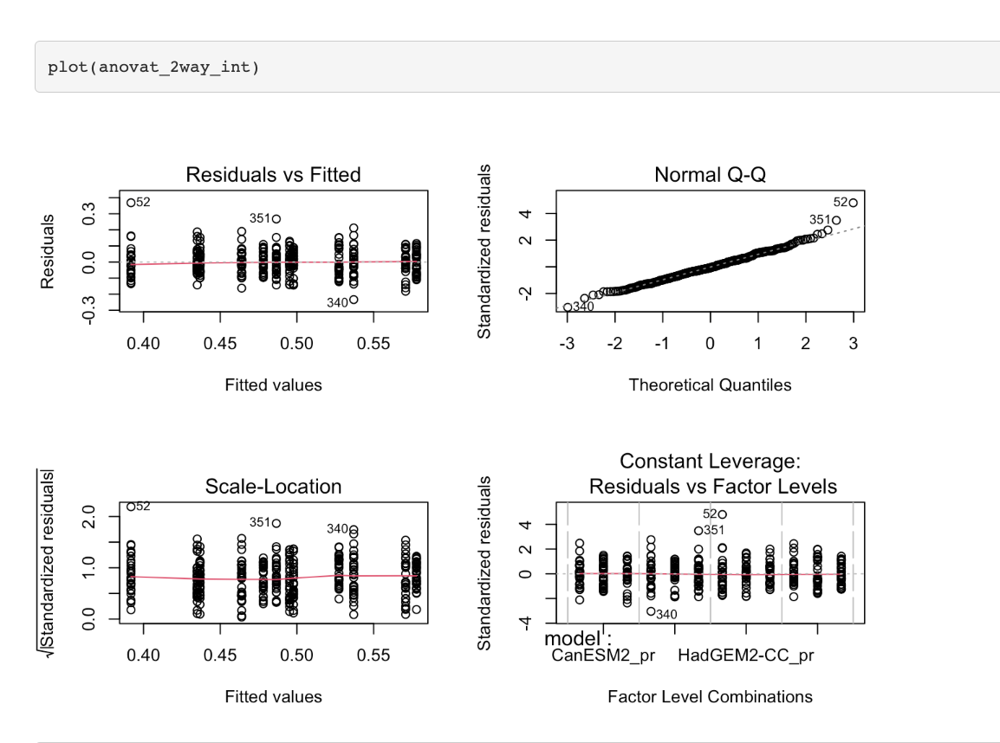
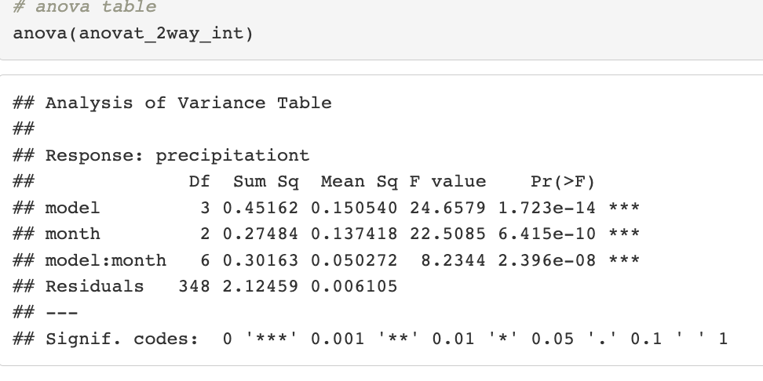
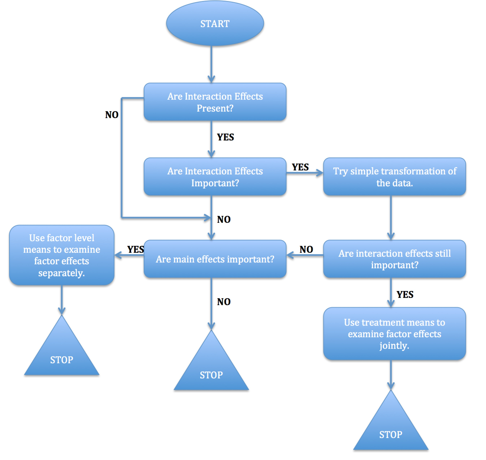

# Linear Models I {#ch5}

## Introduction

Linear models, a fundamental class of statistical models, provide a powerful framework for understanding and quantifying relationships between variables. At their core, linear models assume that the relationship between the dependent variable and one or more independent variables is linear, meaning that a change in the independent variable(s) corresponds to a proportional change in the dependent variable. These models are widely employed in various fields, such as economics, biology, and engineering, for tasks ranging from predicting future outcomes to uncovering associations between variables. Linear models encompass a range of techniques, including simple linear regression for two-variable relationships, multiple linear regression for more complex interactions, and extensions like logistic regression for modeling binary outcomes. Their versatility and interpretability make linear models an indispensable tool in statistical analysis and hypothesis testing, offering insights into the influence of different factors on the phenomenon of interest.

-   Which of your variables is the response variable?
-   Which variables are the explanatory variables?
-   Are the explanatory variables continuous or categorical, or a mixture of both?
-   What kind of response variable do you have: is it a continuous measurement, a count, a proportion, a time at death or events, or a category?

### Model Types

We can categorize linear models in several ways based on the problems we try to solve:

-   Simple regression: $p=1$.
-   Multiple regression: $p>1$.
-   Multivariate multiple regression: more than one response variable. This is not covered in this class.
-   Mixture of quantitative and qualitative explanatory variables: analysis of covariance (ANCOVA).
-   Qualitative explanatory variables: analysis of variance (ANOVA).

**Explanatory variables**

| Explanatory-variable structure                            | Model class |
|:----------------------------------------------------------|:------------|
| All explanatory variables are continuous                  | Regression  |
| All explanatory variables are categorical                 | ANOVA       |
| Explanatory variables are both continuous and categorical | ANCOVA      |

**Response variable**

| Response-variable type    | Model class                         |
|:--------------------------|:------------------------------------|
| Continuous                | Normal regression, ANOVA, or ANCOVA |
| Proportion                | Logistic regression                 |
| Count                     | Log-linear models                   |
| Binary                    | Binary logistic regression          |
| Ordinal or nominal        | Multinomial logistic regression     |
| Time at death or at event | Survival analysis                   |

## Linear Regression Models

### Regression Objectives

-   Prediction of future values of the response for specified values of the predictors.
-   Assessment of the relationship between the explanatory variables and the response. Is there a causal relationship?
-   Summary of the relationship between variables.

### Theory

-   In most applications, several predictors are used instead of a single predictor as in simple linear regression (SLR).
-   The data have the form $(y_i, \mathbf{x}_i)_{i=1}^n$, where $\mathbf{x}_i=(x_{i1},\ldots,x_{ip})^t$ with $x_{i1}=1$.
-   Assume the model

$$
y_i=x_{i1}\beta_1 + x_{i2}\beta_2+\ldots+x_{ip}\beta_p+e_i.
$$

Here, $(\beta_1,\ldots,\beta_p,\sigma^2)$ are the unknown but true parameters, and the $e_i$'s are random errors.

#### Main model assumptions

1.  The mean function $E[y_i]=x_{i1}\beta_1+x_{i2}\beta_2\ldots+x_{ip}\beta_p$ is linear in the $p$ predictors.
2.  The errors $e_i$'s are uncorrelated with mean $0$ and constant variance $\sigma^2$. This is equivalent to $E[e_i]=0$ and $\operatorname{Cov}(e_i,e_j)=\sigma^2 \delta_{ij}$, with $\delta_{ij}=0$ if $i \neq j$ and $\delta_{ij}=1$ if $i=j$.
3.  For hypothesis testing, we further assume that the $e_i$'s are i.i.d. and $e_i\sim N(0,\sigma^2)$.

#### Matrix representation of the MLR

Suppose MLR is valid for all observations $i=1,\ldots,n$. We can write:

$$
\begin{pmatrix}
y_1\\
y_2\\
\vdots\\
y_n
\end{pmatrix}
=
\begin{pmatrix}
x_{11}\beta_1 + x_{12}\beta_2+\ldots+x_{1p}\beta_p+e_1\\
x_{21}\beta_1 + x_{22}\beta_2+\ldots+x_{2p}\beta_p+e_2\\
\vdots\\
x_{n1}\beta_1 + x_{n2}\beta_2+\ldots+x_{np}\beta_p+e_n
\end{pmatrix}.
$$

Equivalently,

$$
\mathbf{y}_{n\times 1}
=
\mathbf{X}_{n\times p}\boldsymbol{\beta}_{p\times 1}
+
\mathbf{e}_{n\times 1},
$$

where

$$
\mathbf{X}=
\begin{pmatrix}
x_{11} & x_{12} & \ldots & x_{1p}\\
x_{21} & x_{22} & \ldots & x_{2p}\\
\vdots & \vdots & \ddots & \vdots\\
x_{n1} & x_{n2} & \ldots & x_{np}
\end{pmatrix},
\quad
\boldsymbol{\beta}=
\begin{pmatrix}
\beta_1\\
\beta_2\\
\vdots\\
\beta_p
\end{pmatrix},
\quad
\mathbf{e}=
\begin{pmatrix}
e_1\\
e_2\\
\vdots\\
e_n
\end{pmatrix}.
$$

Matrix $\mathbf{X}$ is normally called the **design matrix**.

#### Least-Squares Estimation

Using matrix representation, the MLR model can be expressed as[^chapter5_lineari-1]

[^chapter5_lineari-1]: By default, the intercept is included in the model, so the first column of the design matrix $\mathbf{X}$ is a vector of 1's. We further assume that the rank of $\mathbf{X}$ is $p$, i.e., no column of $\mathbf{X}$ is a linear combination of the other columns and $\mathbf{X}$ is a tall and skinny matrix ($n>p$).

$$
\mathbf{y}_{n\times 1}
=
\mathbf{X}_{n\times p}\boldsymbol{\beta}_{p\times 1}
+
\mathbf{e}_{n\times 1},
\qquad
\mathbf{e}\sim N_n(\mathbf{0},\sigma^2 \mathbf{I}_n).
$$

The least-squares estimate of $\boldsymbol{\beta}$ is the vector that minimizes the residual sum of squares (RSS):

$$
RSS=\|\mathbf{y}-\mathbf{X}\boldsymbol{\beta}\|^2
=(\mathbf{y}-\mathbf{X}\boldsymbol{\beta})^t(\mathbf{y}-\mathbf{X}\boldsymbol{\beta}).
$$

Differentiating $RSS$ with respect to $\boldsymbol{\beta}$ and setting this equation to zero gives the least-squares estimator for $\boldsymbol{\beta}$:

$$
\hat{\boldsymbol{\beta}}=(X^T X)^{-1}X^T\mathbf{y}.
$$

### Example: Multivariate Linear Regression

NEED TO ADD EXAMPLES

## ANOVA Models

-   There are many questions we can investigate.
-   Are all models predicting the same average precipitation during summer? During winter?
-   Are precipitation extremes behaving equally among models?
-   Are the seasonal patterns/trends equal among models?

**Example**

**Mean precipitation during summer**

Investigate whether the mean precipitation during the summer months is significantly different among models.

We want to test the hypothesis:

$$
H_0: \mu_1=\mu_2=\mu_3=\mu_4.
$$

In this case, the t-test is not efficient because we would need to make multiple comparisons, $g(g-1)/2$, and the probability of Type I error will increase. Here, $g$ is the number of groups.

**Type I error for multiple tests**

If $1-\alpha$ is the probability of not making a Type I error in one mean comparison, $(1-\alpha)^C$ is the probability of not making a Type I error in $C$ mean-comparison tests. The probability of making a Type I error in $C$ comparisons is $1-(1-\alpha)^C$.

In our case, we have $4\times 3/2=6$ comparisons. If we assume 6 independent comparisons, the Type I error will be:

$$
1-(1-0.05)^6=0.2649,
$$

which is much larger than 0.05. This is called the family-wise Type I error $\alpha_f$.

**Bonferroni correction**

-   If we want the family-wise error rate to be 0.05, for example, we should adjust the level of significance for the pairwise tests.
-   The family-wise Type I error test is adjusted using a level of significance for the pairwise tests equal to $\alpha/C$, where $C$ is the total number of comparisons we need to make.

**Why?**

$$
\Pr(\text{Type I error for all tests})
=1-\Pr(\text{No Type I error for all tests}).
$$

-   $\Pr(\text{No Type I error for all tests})=1-\Pr(\text{At least 1 Type I error}) \geq 1-\sum_{i=1}^C \Pr(\text{Type I error for test } i)=1-C\alpha$.
-   If we want $\Pr(\text{Overall Type I error})\leq \alpha$, we should use a level of significance equal to $\alpha/C$ for the pairwise tests.

### Theory

-   **Model parameterization**
-   **Parameter interpretation**

| Test          | Population assumption        | Location parameter $\mu_0$ |
|:--------------|:-----------------------------|:---------------------------|
| Student's *t* | *iid* $N(\mu,\sigma^2)$      | Mean (same as median)      |
| Signed rank   | *iid* symmetric distribution | Median                     |
| Sign          | *iid*                        | Median                     |

-   **Model properties**
-   **Fitting of ANOVA model**
-   **Fitted values and residuals**
-   **ANOVA table**
-   $F$-test

We want to test whether the means of the groups are really different. We can express this as

$$
\begin{cases}
H_0: \mu_1 = \mu_2 = \ldots = \mu_r,\\
H_{\alpha}: \text{not all } \mu_i,\; i=1,\ldots,r \text{ are equal}.
\end{cases}
$$

Or, in terms of models,

$$
\begin{cases}
H_0: y_{ij} = \mu + e_{ij},\\
H_a: y_{ij} = \mu + \alpha_i + e_{ij}.
\end{cases}
$$

These are two nested models, so we can use the partial $F$-test:

$$
\frac{(RSS_0 - RSS_a)/(r-1)}{RSS_a/(n-r)} \sim F_{r-1,n-r},
$$

under $H_0$.

The test statistic can also be written as

$$
\frac{FSS/(r-1)}{RSS/(n-r)}
= \frac{\text{Between-group Variation}/(r-1)}{\text{Within-group Variation}/(n-r)},
$$

where $FSS$ and $RSS$ are defined in the ANOVA table.

### One-Way ANOVA Models

Data:

| Group     | Observation 1 | Observation 2 | $\ldots$ | Last observation |
|:----------|:--------------|:--------------|:---------|:-----------------|
| group 1   | $y_{11}$      | $y_{12}$      | $\ldots$ | $y_{1n_1}$       |
| group 2   | $y_{21}$      | $y_{22}$      | $\ldots$ | $y_{2n_2}$       |
| $\vdots$  | $\vdots$      | $\vdots$      | $\vdots$ | $\vdots$         |
| group $r$ | $y_{r1}$      | $y_{r2}$      | $\ldots$ | $y_{rn_r}$       |

-   $r$ is the number of groups.
-   $n_i$ denotes the number of observations in the $i$th group.
-   $n=\sum_{i=1}^{r} n_i$ is the total sample size.
-   $y_{ij}$ is observation $j$ for the $i$th group or factor.

**ANOVA model representations**

#### Paragraph 1

-   item 1

$$
W_n=\frac{\left(\sum_{i=1}^n a_i x^{(i)}\right)^2}{\sum_{i=1}^n (x_i -\bar{x})^2}.
$$

some texts

#### Paragraph 2

### ANOVA Model Diagnostics

**Objectives**

-   Check for outliers or unusual observations.
-   Check the residuals vs. fitted values plot for departures from the constant variance assumption.
-   Check the Q-Q plot for departures from the normality assumption.

**Methods**

-   **Box-Cox transformation of the** $Y$ variable
    -   Box and Cox (1964) suggested a family of transformations for positive responses designed to reduce non-normality of the errors. It turns out that in doing this, it often reduces non-linearity as well.
    -   Suppose each $y_i>0$, and consider the following transformation:[^chapter5_lineari-2]

[^chapter5_lineari-2]: The transformation for $\lambda=0$ is justified because $\lim_{\lambda \rightarrow 0} \frac{y^{\lambda} -1}{\lambda}=\log(y)$.

$$
g_{\lambda}(y)=
\begin{cases}
\frac{y^{\lambda} - 1}{\lambda}, & \lambda\neq 0,\\
\log(y), & \lambda=0.
\end{cases}
$$

The aim is to choose $\lambda$ that maximizes the likelihood of the data, under the normal assumption that the transformed data $g_{\lambda}(\mathbf{y})$ has a normal distribution:

$$
g_{\lambda}(\mathbf{y})=\mathbf{X}\boldsymbol{\beta} + \mathbf{e},
\qquad
\mathbf{e} \sim N_n(\mathbf{0},\sigma^2 \mathbf{I}).
$$

-   Note that it does not make sense to simply pick $\lambda$ that minimizes $RSS_{\lambda}$ since, for each $\lambda$, the residual sum of squares is measured on a different scale.
-   In **R**, we can graph the log-likelihood as a function of $\lambda$, $L(\lambda)$, versus $\lambda \in (-2,2)$[^chapter5_lineari-3] and then pick the maximizer $\hat{\lambda}$.
-   It is common to round $\hat{\lambda}$ to a nearby value, such as

[^chapter5_lineari-3]: The method tends to work well for $\lambda$ in this range.

$$
-1,-0.5,0,0.5,\quad \text{or}\quad 1,
$$

so the transformation defined by $\hat{\lambda}$ is easier to interpret.

-   To answer whether we really need the transformation $g_{\lambda}$, we can do hypothesis testing with $H_0:\lambda=1$, or equivalently construct a confidence interval for $\lambda$.

-   **Levene's test for equality of variances**

    -   Run a regression with $|\text{residuals}|\sim X$, i.e., use the absolute residuals as the response in a new one-way ANOVA.
    -   If the $p$-value for the $F$-test is greater than the 1% level, then we conclude that there is no evidence of non-constant variance.

### Comparing Factor-Level Means

**Objectives**

What happens when the $F$-test leads to the conclusion that the factor-level means $\mu_i$ differ?

-   Analysis of the factor-level means of interest using *estimation* techniques.
-   Statistical *tests* concerning the factor-level means of interest.

**Inference for factor-level means**

1.  A single factor-level mean.
2.  A difference between two factor-level means.
3.  A contrast among factor-level means.
4.  A linear combination of factor-level means.

### Two-Way ANOVA Models

**GCMs simulations example**

Consider variables `model` and `month` as two potential predictor factors for precipitation projections. Main questions include:

-   Are model simulations different among the summer months?

-   Are model simulations different among models?

-   Are model simulations for each month varying for each model?

-   **Single-factor**

    1.  Do not explore the entire space of factor combinations.
    2.  Interactions cannot be estimated.
    3.  Full randomization is not possible.
    4.  Multiple stages increase the complexity of the analysis.

-   **Multifactor**

    1.  Efficient replication.
    2.  Assessment of interactions.
    3.  Validity of findings.

**Equal sample sizes for all treatment means**

$$
y_{ijk} = \mu_{ij} + e_{ijk}.
$$

-   $\mu_{ij}$ is the mean of the $i$th level of factor A and the $j$th level of factor B.
-   $e_{ijk}$ are independent $\mathcal{N}(0, \sigma^2)$.
-   $i=1,\ldots,a$.
-   $j=1,\ldots,b$.
-   $k=1,\ldots,n$, where $n>1$.
-   $n_T = nab$ is the total sample size.

Usually, the means $\mu_{ij}$ are decomposed as follows:

$$
\mu_{ij} = \mu + \alpha_i + \beta_j + (\alpha\beta)_{ij},
$$

where

-   $\mu$ is the overall mean.
-   $\alpha_i$ are the factor A, `model`, effects (fixed).
-   $\beta_j$ are the factor B, `month`, effects (fixed).
-   $(\alpha\beta)_{ij}$ are the interaction effects (fixed).

In this example:

-   $a$ is the total number of models (4).
-   $b$ is the total number of months (3).
-   $n$ is the total number of years (30).
-   $n_T=360$.

**Factor effects model for two factors**

$$
y_{ijk} = \mu + \alpha_i + \beta_j + (\alpha \beta)_{ij} + e_{ijk}.
$$

-   $e_{ijk}$ are independent $\mathcal{N}(0, \sigma^2)$.
-   This model is equivalent to the cell-means model, but it is more useful when we want to understand the significance of each term in software like R.
-   Here again, we need to impose constraints to ensure that the estimators for the effects are unique.

**Notation**

| Quantity | Sum | Average |
|:-----------------------|:-----------------------|:-----------------------|
| Cell $(i,j)$ | $y_{ij\cdot} = \sum_{k=1}^{n} y_{ijk}$ | $\bar{y}_{ij\cdot} = \frac{y_{ij\cdot}}{n}$ |
| Row $i$ | $y_{i \cdot \cdot} = \sum_{j=1}^{b} \sum_{k=1}^{n} y_{ijk}$ | $\bar{y}_{i \cdot \cdot} = \frac{y_{i \cdot \cdot}}{bn}$ |
| Column $j$ | $y_{ \cdot j \cdot} = \sum_{i=1}^{a} \sum_{k=1}^{n} y_{ijk}$ | $\bar{y}_{ \cdot j \cdot} = \frac{y_{ \cdot j \cdot}}{an}$ |
| Overall | $y_{\cdot \cdot \cdot} = \sum_{i=1}^{a} \sum_{j=1}^{b} \sum_{k=1}^{n} y_{ijk}$ | $\bar{y}_{\cdot \cdot \cdot} = \frac{y_{\cdot \cdot \cdot}}{nab}$ |

**Fitting of ANOVA**

-   Using the least-squares method, the estimated treatment means are

$$
\hat{\mu}_{ij} = \bar{y}_{ij\cdot}.
$$

-   The factor effects estimators depend on the constraints that we impose. For example, under the *sum constraints*, we have

$$
\hat{\alpha}_{i} = \bar{y}_{i \cdot \cdot} - \bar{y}_{\cdot \cdot \cdot},
\qquad
\hat{\beta}_{j} = \bar{y}_{\cdot j \cdot} - \bar{y}_{\cdot \cdot \cdot}.
$$

$$
(\hat{\alpha \beta})_{ij}
= \bar{y}_{ij \cdot} - \bar{y}_{i\cdot \cdot} - \bar{y}_{\cdot j \cdot} + \bar{y}_{\cdot \cdot \cdot}.
$$

-   The fitted values and residuals are computed as usual:

$$
\hat{y}_{ijk} = \bar{y}_{ij\cdot},
\qquad
r_{ij} = y_{ijk} - \hat{y}_{ijk}.
$$

**Model diagnostics**

-   Model diagnostic plots suggest a transformation is needed.
-   The cubic-root transformation is applied to precipitation.
-   Diagnostic plots are reproduced after transformation to check model assumptions again.

Diagnostic plots after the cubic-root transformation is applied:

{fig-width="75%"}

-   The diagnostics for the transformed model look good.
-   The next goal is to understand the effects: main effects and interaction effects.
-   We start by creating an *interaction plot*, that is, the plot of the response against the factor-level combinations.
-   This plot will help us visually inspect the presence or absence of interactions and the nature of the main effects.

**Partitioning of total sum of squares**

$$
\underbrace{y_{ijk} - \bar{y}_{\cdot \cdot \cdot}}_{\text{Total Deviation}}
=
\underbrace{\bar{y}_{ij\cdot}-\bar{y}_{\cdot \cdot \cdot}}_{\substack{\text{Deviation of estimated}\\\text{treatment mean around}\\\text{overall mean}}}
+
\underbrace{y_{ijk} - \bar{y}_{ij\cdot}}_{\substack{\text{Deviation}\\\text{around estimated}\\\text{treatment mean}}}.
$$

$$
TSS = FSS + RSS,
$$

where

$$
\begin{aligned}
TSS &= \sum_i \sum_j \sum_k (y_{ijk} - \bar{y}_{\cdot \cdot \cdot})^2,\\
FSS &= n \sum_{i} \sum_{j} (\bar{y}_{ij\cdot} - \bar{y}_{\cdot \cdot \cdot})^2,\\
RSS &= \sum_i \sum_j \sum_k (y_{ijk} - \bar{y}_{ij \cdot})^2
=  \sum_i \sum_j \sum_k r_{ijk}^{2}.
\end{aligned}
$$

**Partitioning of treatment sum of squares**

$$
\underbrace{\bar{y}_{ij\cdot} - \bar{y}_{\cdot \cdot \cdot}}_{\substack{\text{Deviation of estimated}\\\text{treatment mean around}\\\text{overall mean}}}
=
\underbrace{\bar{y}_{i \cdot \cdot}-\bar{y}_{\cdot \cdot \cdot}}_{\substack{\text{A main}\\\text{effect}}}
+
\underbrace{\bar{y}_{\cdot j \cdot} - \bar{y}_{\cdot \cdot\cdot}}_{\substack{\text{B main}\\\text{effect}}}
+
\underbrace{\bar{y}_{ij\cdot} - \bar{y}_{i\cdot \cdot} - \bar{y}_{\cdot j \cdot} + \bar{y}_{\cdot \cdot \cdot}}_{\substack{\text{AB interaction}\\\text{effect}}}.
$$

$$
FSS = SSA + SSB + SSAB \quad \text{(orthogonal decomposition)},
$$

where

$$
\begin{aligned}
SSA &= nb \sum_i  (\bar{y}_{i \cdot \cdot}-\bar{y}_{\cdot \cdot \cdot})^2,\\
SSB &= na \sum_{j} (\bar{y}_{\cdot j \cdot} - \bar{y}_{\cdot \cdot\cdot})^2,\\
SSAB &= n\sum_i \sum_j  (\bar{y}_{ij\cdot} - \bar{y}_{i\cdot \cdot} - \bar{y}_{\cdot j \cdot} + \bar{y}_{\cdot \cdot \cdot})^2.
\end{aligned}
$$

**ANOVA table**

| Source of variation | SS     | df           | MS                               |
|:-----------------|:-----------------|:-----------------|:-----------------|
| Factor A            | $SSA$  | $a-1$        | $MSA = \frac{SSA}{a-1}$          |
| Factor B            | $SSB$  | $b-1$        | $MSB = \frac{SSB}{b-1}$          |
| AB interactions     | $SSAB$ | $(a-1)(b-1)$ | $MSAB = \frac{SSAB}{(a-1)(b-1)}$ |
| Error               | $RSS$  | $ab(n-1)$    | $MSE = \frac{RSS}{ab(n-1)}$      |
| Total               | $TSS$  | $nab-1$      |                                  |

$F$ tests

-   In order to test for the statistical significance of the interaction terms, we use partial $F$-tests. So, we fit a main-effects model, i.e., no interactions:

$$
y_{ijk} = \mu + \alpha_i + \beta_j + e_{ijk}.
$$

-   Then, we compare the two nested models:

$$
\begin{cases}
H_0: \text{smaller model with } p_0 \text{ coefficients},\\
H_{\alpha}: \text{larger model with } p_{\alpha} \text{ coefficients}.
\end{cases}
$$

The $F$-test is formulated as

$$
F=\frac{(RSS_0 - RSS_{\alpha})/(p_{\alpha}-p_0)}{MSE_{\alpha}}
\sim F_{p_{\alpha}-p_0, n-p_{\alpha}}
\quad \text{under } H_0.
$$

-   We can also perform $F$-tests directly using the ANOVA table. For the interaction term, we have:

$$
F_{AB} = \frac{MSAB}{MSE} \sim F_{(a-1)(b-1), ab(n-1)}.
$$

{fig-width="70%"}

-   **Hierarchy principle:** we test for main effects only if the interaction term is not statistically significant.

**Strategy for analysis: two or more factor studies**

{fig-width="85%"}

## Summary
