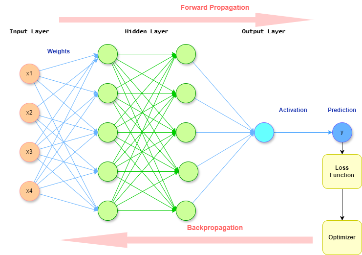
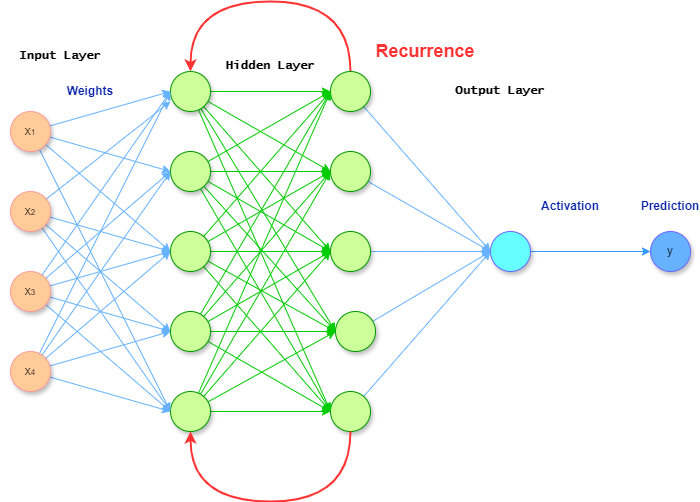
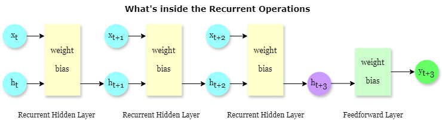
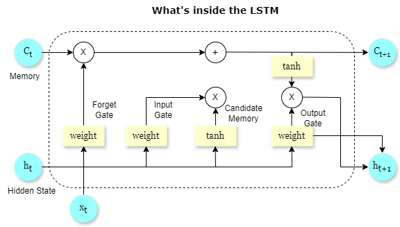

# **Chapter 7. Predictive Models**

In this chapter we introduce additional models where prediction, more than interpretability, is the main goal. These models are also classified as nonlinear models, since there is no assumption of a linear relationship between potential predictors $X = X_1, X_2, \ldots, X_p$ and the response variable $Y$.

Polynomial regression can introduce nonlinear relationships between the response and the predictors; however, these models still have an additive structure, and the model parameters can be estimated by least squares to keep the variance of the parameter estimates low.

In the following models, the exact form of the nonlinearity between the response and the predictors is not known explicitly. We discuss several nonlinear models that may be useful in environmental applications, especially when the data have a sequential structure, temporal dependence, or spatial reference. Neural networks and their deep learning counterparts, support vector machines, random forests, and multivariate adaptive regression splines (MARS) will be used to illustrate nonlinear predictive approaches. We will compare these procedures using an example for drought prediction.

## Section 1. Drought Prediction

The presence of drought can be an important environmental challenge for many regions of the world, limiting food security due to massive crop failure. Several types of droughts have been defined in the literature: (1) meteorological drought, linked to deficits in precipitation amounts; (2) agricultural drought, linked to deficits in soil moisture; (3) hydrological drought, linked to reduced streamflow and runoff; and (4) socioeconomic drought, linked to limited water use by humans (Yihdego et al., 2019).

Among the many available drought indices, the Standardized Precipitation Index (SPI) and the Standardized Precipitation Evapotranspiration Index (SPEI) are well-known indicators of drought occurrence, duration, and intensity. According to Gutman's classification scale, SPI values greater than 2 indicate extremely wet conditions, while values lower than -2 indicate extremely dry conditions. We can predict SPI in a regression context by treating it as a quantitative measure, or we can use a classification approach by adopting an appropriate drought classification scale. The SPEI index additionally considers a temperature component and a simplified water balance, which may be beneficial for agricultural drought monitoring.

Large-scale oceanic-atmospheric phenomena responsible for anomalous heating and cooling of the Atlantic and Pacific oceans are known to drive climatic conditions at local scales. Among these climatic teleconnections, the El Niño-Southern Oscillation (ENSO) and the North Atlantic Oscillation (NAO) are two notable examples. Sing et al. (2021) explored the impacts of different teleconnections on streamflow patterns for the contiguous United States and found that the Atlantic Multidecadal Oscillation had a stronger effect on streamflow compared with the other oscillations. In this example, we explore the impact of the Atlantic Multidecadal Oscillation (AMO), the Pacific Decadal Oscillation (PDO), the North Atlantic Oscillation (NAO), and the Oceanic Niño Index (ONI) on the SPI and SPEI drought indicators.

Figures XXXX show the monthly time series for the oceanic-atmospheric oscillation indices and the drought indices. We will use these time series to illustrate the different predictive models described in this chapter.

### Inspecting Drought Data

The data we will be using is the drought data, we will use it to train models that predict the $SPI$ and $SPEI$ indices.

```{r, echo=F, eval=T, message=F, warning=F}
## This chunk, code is hidden, only output is shown
# set directories
directory_path <- "C:/Users/kurtj/OneDrive/Desktop/ProfBravo_EnvStats/Env_Stats_Book/data/drought_data"
```

Read all data files in the directory and combine them to a single dataframe

```{r, message=FALSE}
# load necessary libraries
library(readr)
library(tidyverse)
library(zoo)

file_names <- list.files(path = directory_path, pattern = "^[A-Z]+\\.csv$", full.names = TRUE)
data_list <- lapply(file_names, read_csv) # read each file and create a list of dataframes
drought_data <- reduce(data_list, full_join, by = "Time")
```

Process the data, including transforming the "Time" column into a Date object because we are dealing with a time-series data

```{r, message=FALSE}
drought_data$Time <- as.Date(as.yearmon(drought_data$Time, "%Y %b")) # convert the Time column to a Date object
drought_data <- na.omit(drought_data) # remove rows with NAs

# plot SPI and SPEI against Time
ggplot(data = drought_data, aes(x = Time)) +
  geom_line(aes(y = SPI, colour = "SPI"), colour = "#1B5E20") +  # lighter Blue for SPI
  geom_line(aes(y = SPEI, colour = "SPEI"), colour = "#81D4FA") +  # darker Blue for SPEI
  labs(title = "Time Series of SPI and SPEI",
       x = "Time",
       y = "Index Value",
       colour = "Legend") +
  theme_minimal() +
  theme(axis.text.x = element_text(angle = 45, hjust = 1),  # rotate date labels for better readability
        legend.title = element_blank(),  # remove the legend title
        legend.position = "bottom",  # adjust legend position if necessary
        legend.text = element_text(size = 12))  # adjust text size for better legibility
```

Train/Test Split

```{r, message=FALSE}
n <- nrow(drought_data)
train_size <- floor(0.7 * n)

train_indices <- 1:train_size
test_indices <- (train_size + 1):n

train_data <- drought_data[train_indices, ]
test_data <- drought_data[test_indices, ]

print(sprintf("Total records: %d", n))
print(sprintf("Training records: %d, Test records: %d", 
              nrow(train_data), nrow(test_data)))
```

#### Standardization of Data

Neural networks models are highly sensitive to the scale of input data. Those models typically use gradient-based optimization techniques to find the minimum of the loss function, and if the features have varying scales, it can cause disproportionate gradient updates. This can lead to slower convergence during training or even cause the training process to diverge. In addition, many neural networks use activation functions like sigmoid, tanh, or ReLU, which are sensitive to the magnitude of their inputs. Large input values can cause functions like sigmoid and tanh to saturate at their tails, where the gradient is near zero. This saturation can lead to vanishing gradients, where the gradient becomes too small for effective learning during backpropagation. Then, without standardization, features with larger scales can dominate the learning process by overshadowing the contributions of features with smaller scales. Standardizing ensures that each feature contributes equally to model learning.

An important note for standardizing data: Do not standardize the data altogether. Do them after the train/test split instead. This is because when you use information from outside the training dataset to train the model, you would have "data leakage". If the standardization parameters (mean and standard deviation) are derived from the entire dataset, then information from the test set has inadvertently been used to scale the training set. Data leakage is considered cheating in training models, and performance-wise, it can lead to overly optimistic performance estimates during training and poor generalization to new data.

```{r, message=FALSE}

```

#### Lags in Time Series Analysis

## Section 2. Neural Networks

Neural networks (NN) were created around the 1980s and became very popular around 2010 (Titterington, 2010). Neural networks are nonlinear regression models inspired by theories about the functioning of the brain.

In a simple *feed-forward neural network*, a quantitative response $Y$ can be modeled as a function of a set of $K$ hidden units available in a hidden layer in two steps:

-   First, $K$ activation units $A_k$ $(k = 1, \ldots, K)$ are built as functions of the input variables or input features $X_1, X_2, \ldots, X_p$ using a nonlinear activation function $g(z)$:

$$
A_k = g\left(w_{k0} + \sum_{j=1}^p w_{kj}X_j\right).
$$

-   These $K$ activation units $A_k$ are then used as inputs to the output layer:

$$
f(X) = \beta_0 + \sum_{k=1}^K \beta_k A_k.
$$

All parameters $w_{i0}, \ldots, w_{ip}$ $(i = 1, \ldots, K)$ and $\beta_0, \beta_1, \ldots, \beta_K$ are estimated from the data.

The hidden activation units represent the neurons in the brain. Depending on the activation function, they can be firing, with values close to 1, or silent, with values close to 0.

Figure XXX represents a one-layer feed-forward neural network.

Popular activation functions include the sigmoid function,

$$
g(z) = \frac{1}{1 + e^{-z}} = \frac{e^z}{1 + e^z},
$$

and the rectified linear unit (ReLU),

$$
g(z) = (z)_+ =
\begin{cases}
0, & \text{if } z < 0, \\
z, & \text{otherwise}.
\end{cases}
$$

These functions are depicted in Figure XX.

Typically, the parameters of a neural network for a quantitative response are estimated by minimizing a squared-error loss function of the form

$$
L(\Theta) = \sum_{i=1}^n \left(y_i - f_{\theta}(x_i)\right)^2,
$$

where $f(\cdot)$ is given by the feed-forward network and the subscript $\theta$ indicates that $f$ depends on the unknown parameters $\Theta$.

This minimization problem is non-convex and may have multiple local minima rather than a single global solution. The two main approaches to estimating $\Theta$ are gradient descent, also called a *slow learner* because of its iterative nature and stopping criteria when overfitting is detected, and regularization methods such as ridge regression, which impose constraints on parameter estimates when minimizing the loss function:

$$
L(\Theta) = \sum_{i=1}^n \left(y_i - f_{\theta}(x_i)\right)^2
+ \lambda\left(\sum_{i=1}^K \sum_{j=1}^p w_{ij}^2 + \sum_{j=1}^p \beta_j^2\right).
$$

As the regularization component increases, the fitted model becomes smoother and the chance of overfitting is reduced.



**SHOULD WE INCLUDE CONCEPTS ABOUT EPOCHS, BATCH SIZE, DROPOUT, VALIDATION, ETC?**

#### Illustration of A Feed-Forward Neural Network

Keras in R is a high-level neural networks API that enables easy and fast prototyping of deep learning models. It operates on top of TensorFlow and is available in Python, too.

Building a neural network model in keras is straightforward as you just need to define all components using the `%>%` symbol. We are building a simple neural network with 2 linear layers, a dropout layer and a relu activation layer. We will let it take 3 variables for input: AMO, NAO and ONI

```{r, message=FALSE}
library(keras)

feedforward_nn <- keras_model_sequential() %>%
  layer_dense(units = 64, input_shape = c(3), activation = 'relu') %>%  # first hidden layer with more units and ReLU activation
  layer_dense(units = 32, activation = 'relu') %>%  # additional hidden layer
  layer_dropout(rate = 0.5) %>%  # dropout layer to prevent overfitting
  layer_dense(units = 1, activation = 'linear')  # output layer with linear activation

summary(feedforward_nn) # show summary of the model
```

After we define and initialize the model, we need to compile

```{r, message=FALSE}
feedforward_nn %>% compile(
  loss = 'mean_squared_error',
  optimizer = optimizer_rmsprop(),
  metrics = c('mean_absolute_error')
)
```

We will use NAO as the predictor to predict SPEI, the `fit()` operator will start the training process of the model. The number of training epochs is 100, and the batch size is 32. Batch size determins how many data samples the model sees before making a weight update. This parameter is to offer a balance between training speed and network stability. The validation split of 0.2 means that 20% of the training data is used for validation.

```{r, fold=TRUE}
train_x <- as.matrix(cbind(train_data$AMO, train_data$NAO, train_data$ONI))
train_y <- as.matrix(train_data$SPEI)

train_x <- scale(train_x)
train_y <- scale(train_y)

history <- feedforward_nn %>% fit(
  train_x,
  train_y,
  epochs = 100,
  batch_size = 32,
  validation_split = 0.2
)

```

Here we will fetch the training history and plot the change in training and validation loss

```{r, message=FALSE}
plot(history)
```

We can see that the model has trained for 100 epochs. Now we can make predictions and check its accuracy on the testing data.

```{r, message=FALSE}
test_x <- as.matrix(cbind(test_data$AMO, test_data$NAO, test_data$ONI))
test_y <- as.matrix(test_data$SPEI)

test_x <- scale(test_x)
test_y <- scale(test_y)

predictions <- predict(feedforward_nn, test_x)
# calculate the Mean Squared Error
mse <- mean((predictions - test_y) ^ 2)
print(mse)
```

In our basic model, we predict the SPEI index using the values of AMO, NAO, and ONI at each timestamp. However, this approach does not account for the time-dependency of the data, meaning it does not utilize information from previous timestamps. In the next section, we will explore more advanced neural networks that are specifically designed to handle sequential data by incorporating temporal dependencies.

### Deep LEARNING

Neural networks can have multiple hidden layers in order to capture complex data structures and hidden hierarchies in the data. These models are called multi-layer neural networks. When more than three hidden layers are added, the model is commonly called a *deep learning* model.

There are many kinds of neural networks. Convolutional neural networks (CNNs) are used mainly for image and video classification by recognizing specific features of an object anywhere in an image. For sequential data, recurrent neural networks (RNNs) and long short-term memory networks (LSTMs) are more appropriate. We will concentrate on presenting examples of these models.

Examples of sequential data include time series of climatic variables such as temperature, precipitation, and soil moisture. We may be interested in forecasting one or several of these variables one or more time steps ahead.

Economic and financial time series, such as stock prices and inflation rates, provide other examples of sequential data. Similar predictive questions arise when one wants to forecast one or more future values of these time series.

### Recurrent Neural Networks

In a recurrent neural network (RNN), the input $X$ is usually a sequence of objects or data values of the form $X = \{X_1, X_2, \ldots, X_p\}$. A sequence of words in a document can also be the input to an RNN, where $X$ represents a document and each $X_i$ represents a word. The output $Y$ can also be a sequence of objects or values, such as a translation of the document, but it can also be a scalar, such as a label in a review document.

Suppose that $X$ is a sequence of vectors of the form $\mathbf{X} = \{\mathbf{X}_1, \mathbf{X}_2, \ldots, \mathbf{X}_N\}$, where each $\mathbf{X}_i = (X_{i1}, X_{i2}, \ldots, X_{ip})$ has $p$ components. A simple RNN with one hidden layer $\mathbf{A}$ consists of $N$ hidden units $\mathbf{A}_1, \mathbf{A}_2, \ldots, \mathbf{A}_N$, where $\mathbf{A}_i = (A_{i1}, A_{i2}, \ldots, A_{iK})$. Each $\mathbf{A}_i$ produces an output $O_i$ calculated as

$$
O_i = \beta_0 + \sum_{k=1}^K \beta_k A_{ik}.
$$

Each $A_{ik}$ can be expressed as

$$
A_{ik} = g\left(v_{k0} + \sum_{j=1}^p v_{kj}X_{ij} + \sum_{l=1}^K u_{kl}A_{i-1,l}\right),
$$

where $g(\cdot)$ is an activation function, such as the ReLU function.

Each output $O_i$ is a linear combination of the elements of the hidden layer or activation vector $\mathbf{A}_i$. The components of the input vector $\mathbf{X}_i$ and the previous activation vector $\mathbf{A}_{i-1}$ are fed into the activation vector $\mathbf{A}_i$. These activation vectors include information from the history of previous activation vectors. The weight matrices $V$, $U$, and $B$ are used to process each vector $\mathbf{X}_i$ sequentially until the value of $O_N$ is obtained. These weight matrices do not change with $i$, which means that they are *weight-sharing* matrices.





### Long-Short-Term memory RNN and Drought prediction

The simple RNN described above can be enhanced by considering additional activation vectors in the hidden layer: a closer activation vector in time and a longer activation vector in time. This RNN version is called the long short-term memory (LSTM) version of an RNN. When an activation vector $\mathbf{A}_i$ is calculated, it receives inputs from an activation vector farther back in time, representing long-term memory, and an activation vector closer in time, representing short-term memory.

The rationale behind an LSTM neural network is to include an additional component within the neural network that can learn when to remember important information and when to forget unnecessary information. The network can learn when information is no longer needed and what information will be needed later. For more detail, see Graves and Schmidhuber (2005).

In time series, it is common to observe significant autocorrelation up to a certain lag, that is, when considering the pair of variables $(x_t, x_{t-l})$. The autocorrelation functions of the drought and macroclimatic indices are shown in Figure XXX.



#### An LSTM model that predicts 1 unit into the future

A simple example of a sequential model would be to use a set amount of past data to predict the nearest future data point. We will build an LSTM model that takes the SPEI values from 30 past data points and predicts the SPEI value for the next data point.

First, we need to organize our data into 'past data' and 'future data'. The function below iteratively partitions the SPEI index in the training data into many past-future pairs.

```{r, message=FALSE}
# create a function to make the transformation
create_dataset <- function(data, steps=1) {
  X = list()
  Y = list()
  for (i in 1:(length(data) - steps)) {
    end_ix <- i + steps - 1
    X[[i]] <- data[i:end_ix]
    Y[[i]] <- data[end_ix + 1]
  }
  return(list(X = array(unlist(X), dim = c(length(X), steps, 1)), Y = array(unlist(Y), dim = c(length(Y)))))
}

# we are using 10 past data points to predict the next step
steps <- 30
train_transformed <- create_dataset(train_y, steps)
```

Now we can define the structure of our LSTM model. It begins with an LSTM layer featuring 50 units to capture temporal dependencies. Next, a Dense layer with a single unit predicts a future value. This configuration is basic yet robust enough to learn from sequences and make predictions based on historical data.

```{r, message=FALSE}
# define the lstm model structure
lstm <- keras_model_sequential() %>%
  layer_lstm(units = 50, input_shape = c(steps, 1), return_sequences = FALSE) %>%  # lstm layer to process time series data
  layer_dense(units = 1)  # output layer to predict the next data point

# compile the model with mean squared error as the loss function and use an optimizer
lstm %>% compile(
  loss = 'mean_squared_error',
  optimizer = 'adam',
  metrics = c('mean_absolute_error')
)

# summary of the model to see the architecture and parameters
summary(lstm)
```

The LSTM model undergoes 100 training epochs with a batch size of 32. 20% of the training data is reserved for validation purposes.

```{r, message=FALSE}
train_X <- train_transformed$X
train_Y <- train_transformed$Y

history <- lstm %>% fit(
  train_X,                          # training features
  train_Y,                          # target output
  epochs = 100,                     # number of epochs to train for
  batch_size = 32,                  # number of samples per gradient update
  validation_split = 0.2,           # percentage of data to use for validation
  shuffle = TRUE                    # shuffle training data before each epoch
)

plot(history)
```

### Additional Deep Learning Packages in R

#### H2O Package

H2O is a...

```{r, message=FALSE}
library(h2o)
h2o.init()

h2o_data <- as.h2o(drought_data)

# you can do a train/test split in the h20 framework
train = h2o.splitFrame(h2o_data, ratios = c(0.7,0.15), seed =1)[[1]] 
valid = h2o.splitFrame(h2o_data, ratios = c(0.7,0.15), seed =1)[[2]] 
test = h2o.splitFrame(h2o_data, ratios = c(0.7,0.15), seed =1)[[3]] 
```

Specify model structure

```{r, message=FALSE}
dl_model <- h2o.deeplearning(
  x = c("NAO", "NAO_lag1", "NAO_lag2"), # Using NAO and its lags as predictors
  y = "SPEI",                           # Target variable
  training_frame = train,
  validation_frame = valid,
  activation = "Rectifier",
  hidden = c(200, 100, 50),             # Two hidden layers with 50 neurons each
  epochs = 100
)
```

```{r, message=FALSE}
# Make predictions on the test set
predictions <- h2o.predict(dl_model, newdata = test)
print(predictions)
```

```{r, message=FALSE}
train
```

```{r, message=FALSE}
actuals_vs_preds <- as.data.frame(test[,"SPEI"])
actuals_vs_preds$Predicted_SPEI <- as.vector(predictions)
```

```{r, message=FALSE}
ggplot(actuals_vs_preds, aes(x = Time)) +
  geom_line(aes(y = SPEI, colour = "Actual"), linewidth = 1) +
  geom_line(aes(y = Predicted_SPEI, colour = "Predicted"), linewidth = 1) +
  labs(title = "Actual vs Predicted SPEI",
       x = "Time",
       y = "SPEI Index",
       colour = "Legend") +
  theme_minimal()
```

#### deepNet

deepNet is...

```{r, message=FALSE}
library(deepnet)
```

**dbn is for weight initialization by a deep belief network**

```{r, message=FALSE}
set.seed(123)  # For reproducibility
dbn_model <- dbn.dnn.train(train_x, train_y, hidden = c(25, 15), 
                       learningrate = 0.05, momentum = 0.1, 
                       output = "linear", numepochs = 100)
```

We can check the prediction accuracy from this model

```{r, message=FALSE}
predictions <- nn.predict(dbn_model, test_x)

rmse <- sqrt(mean((predictions - test_y)^2))
print(paste("Root Mean Squared Error (RMSE):", rmse))
```

#### neuralNet

neuralNet is...

You can use `~` to specify the formula, but here we need to re-define the data so that it has both the predictors and the truth

```{r, message=FALSE}
library(neuralnet)

set.seed(123)
nn <- neuralnet(SPEI ~ AMO + NAP + ONI, 
                data = train_data, 
                hidden = c(4,2), 
                linear.output = TRUE,
                threshold = 0.01)
```

```{r, message=FALSE}
plot(nn,rep = "best")
```

```{r, message=FALSE}
pred <- predict(model, test_data)

# Actual vs Predicted
predicted_values <- nn_results$net.result
actual_values <- test_data$SPEI

# Calculate RMSE
rmse <- sqrt(mean((predicted_values - actual_values)^2))
print(paste("Root Mean Squared Error (RMSE):", rmse))

# Visual comparison
plot(actual_values, type = 'o', col = 'blue', ylim = range(c(actual_values, predicted_values)), pch = 16, xlab = "Index", ylab = "SPEI")
points(predicted_values, type = 'o', pch = 15, col = 'red')
legend("bottomright", legend = c("Actual", "Predicted"), col = c("blue", "red"), pch = c(16, 15))
```

## Section 3. Support Vector Machines

Support vector machines (SVMs) are a popular approach developed in the 1990s. They are mainly used as classifiers, but they can also be used for regression and time-series prediction (Müller et al., 1997).

SVMs use the concept of separating hyperplanes. A hyperplane in a $p$-dimensional space is a flat affine subspace of dimension $p - 1$. For example, in two dimensions $(p = 2)$, a flat affine subspace is a straight line. In three dimensions $(p = 3)$, a flat affine subspace is a plane. More generally, a flat affine subspace can be viewed as a slice of an affine space.

In a two-dimensional space, a hyperplane can be defined as

$$
\beta_0 + \beta_1 X_1 + \beta_2 X_2 = 0.
$$

This straight-line equation divides the two-dimensional space into two halves: points $(X_1, X_2)^\top$ such that $\beta_0 + \beta_1 X_1 + \beta_2 X_2 < 0$, and points such that $\beta_0 + \beta_1 X_1 + \beta_2 X_2 > 0$.

In a $p$-dimensional space, the equation

$$
\beta_0 + \beta_1 X_1 + \beta_2 X_2 + \cdots + \beta_p X_p = 0
$$

defines a hyperplane. A point $(X_1, X_2, \ldots, X_p)^\top$ lies on one side of the space or the other depending on whether it satisfies

$$
\beta_0 + \beta_1 X_1 + \beta_2 X_2 + \cdots + \beta_p X_p > 0
$$

or

$$
\beta_0 + \beta_1 X_1 + \beta_2 X_2 + \cdots + \beta_p X_p < 0.
$$

In a two-class classification setting, we have a response variable $Y$ and training observations $(y_1, y_2, \ldots, y_n)$ with training features in a data matrix $\mathbf{X}$ of dimension $n \times p$. The row vectors are $\mathbf{x}_i = (x_{i1}, x_{i2}, \ldots, x_{ip})^\top$, for $i = 1, \ldots, n$. The labels $y_i$ can take values in $\{-1, 1\}$. The goal is to develop a classifier that correctly classifies a testing feature vector $(x_1^*, x_2^*, \ldots, x_p^*)$.

Other approaches to this task include logistic regression, discriminant analysis, and classification trees, some of which are discussed later in this chapter.

### Hyperplane, Margin, and Support Vector

Intro (to be filled)

#### Start with hyperplane:

**Hyperplane and Margin**

**Hyperplane**: In an n-dimensional space, a hyperplane is a flat affine subspace of dimension n-1. For a two-class classification problem, a hyperplane can be described mathematically by the equation:

$$
\mathbf{w} \cdot \mathbf{x} + b = 0
$$

Where: - $\mathbf{w}$ is the weight vector perpendicular to the hyperplane. - $\mathbf{x}$ is the feature vector. - $b$ is the bias term, adjusting the distance of the hyperplane from the origin.

**Linear Separable Case**

The linearly separable case is the simplest case for SVM. It means that it's possible to find a hyperplane that perfectly separates the classes such that:

$$
y_i (\mathbf{w} \cdot \mathbf{x}_i + b) \geq 1, \text{ for all } i
$$

where $y_i$ are the labels associated with each data point $\mathbf{x}_i$, taking values +1 or -1 depending on the class.

**Margin**: The margin is defined as the distance between the closest points of the data classes and the hyperplane. For a point $\mathbf{x}_i$ on the correct side of the hyperplane, this distance is given by:

$$
\text{Distance} = \frac{|\mathbf{w} \cdot \mathbf{x}_i + b|}{\|\mathbf{w}\|}
$$

The objective of SVM is to maximize this margin to enhance the model's generalization ability.

**Support Vector**: Support vectors are the data points that lie closest to the decision surface (hyperplane). They are used to determine the hyperplane. These points satisfy:

$$
\mathbf{w} \cdot \mathbf{x}_i + b = \pm 1
$$

where $+1$ and $-1$ correspond to the two different classes. The support vectors are exactly on the boundary of the margin.

```{r, echo=False}
# Load necessary libraries
library(e1071)
library(ggplot2)

# Set seed for reproducibility
set.seed(123)

# Generate sample data
group1 <- data.frame(x = rnorm(50, mean = 2), y = rnorm(50, mean = 2), class = factor(1))
group2 <- data.frame(x = rnorm(50, mean = -2), y = rnorm(50, mean = -2), class = factor(2))
data <- rbind(group1, group2)

# Train the SVM model
svm_model <- svm(class ~ x + y, data = data, type = 'C-classification', kernel = 'linear')

# Extract model coefficients
w <- t(svm_model$coefs) %*% svm_model$SV
b <- -svm_model$rho

# Define the decision boundary function
decision_boundary <- function(x) {
  -(w[1] * x + b) / w[2]
}

# Prepare data frame for ggplot
boundary_data <- data.frame(x = seq(min(data$x), max(data$x), length.out = 100))
boundary_data$y <- decision_boundary(boundary_data$x)

# Plotting
plot <- ggplot(data, aes(x = x, y = y, color = class)) +
  geom_point(alpha = 0.5, size = 3) +
  geom_line(data = boundary_data, aes(x = x, y = y), color = "black") +
  labs(title = "SVM Classification with Hyperplane",
       x = "X-axis",
       y = "Y-axis") +
  scale_color_manual(values = c("blue", "red"))

print(plot)
```

**Maximization Problem**

Now that we know what a simple linear separable case is for SVM, we can define the problem that SVM eventually solves. Essentially, just like most machine learning algorithms, SVM solves an optimization problem, in this case, to maximize the margin between the hyperplane and the support vectors. The optimization problem in SVM can be formulated as:

$$
\begin{aligned}
& \text{Minimize: } \frac{1}{2} \|\mathbf{w}\|^2 \\
& \text{Subject to: } y_i (\mathbf{w} \cdot \mathbf{x}_i + b) \geq 1 \text{ for all } i
\end{aligned}
$$

The objective function $\frac{1}{2} \|\mathbf{w}\|^2$ minimizes the norm of the weight vector, which is equivalent to maximizing the margin (since the margin is inversely proportional to $\|\mathbf{w}\|$). This is a quadratic programming problem. In practice, SVM uses Lagrange multipliers to transform this into a problem that involves only the dot products of samples.

#### Non-separable case and soft margin

In non-separable cases, the formulation is adjusted by introducing slack variables $\xi_i$ to allow misclassification of difficult or noisy examples:

$$
\begin{aligned}
& \min_{\mathbf{w}, b, \xi} \frac{1}{2} \|\mathbf{w}\|^2 + C \sum_{i=1}^n \xi_i \\
& \text{subject to} \quad y_i (\mathbf{w} \cdot \mathbf{x}_i + b) \geq 1 - \xi_i, \quad \text{for all } i = 1, \ldots, n \\
& \xi_i \geq 0, \quad \text{for all } i = 1, \ldots, n
\end{aligned}
$$

Here, $C$ is a penalty parameter that controls the trade-off between achieving a low error on the training data and maintaining a large margin.

-   **Dual Formulation**

To simplify solving this optimization problem, SVM formulations often convert this "primal" problem into its "dual" form. The dual problem focuses on maximizing a Lagrangian based on conditions derived from the primal problem:

$$
\begin{aligned}
& \max_{\alpha} \left( \sum_{i=1}^n \alpha_i - \frac{1}{2} \sum_{i,j=1}^n y_i y_j \alpha_i \alpha_j \langle \mathbf{x}_i, \mathbf{x}_j \rangle \right) \\
& \text{subject to:} \\
& \sum_{i=1}^n \alpha_i y_i = 0, \\
& 0 \leq \alpha_i \leq C, \quad \text{for all } i = 1, \ldots, n
\end{aligned}
$$

#### Non-linear SVM, Kernel Trick

The kernel trick maps data into a higher-dimensional space without actually performing the transformation computationally. This allows the SVM algorithm to operate in a high-dimensional (possibly infinite-dimensional) feature space where the data might become linearly separable, without the need to explicitly calculate the coordinates in this space.

In SVM, the separation is achieved by constructing a hyperplane that maximizes the margin between the two classes. For non-linear data, this hyperplane might not exist in the original feature space. By applying a kernel function, you can implicitly calculate the dot products between all pairs of data points as if they were in the higher-dimensional space, thus finding a hyperplane in this new space.

The kernel function replaces the dot product used in the linear SVM model. The dual form of the SVM optimization problem becomes:

**Dual Problem with Kernel**:

$$
\begin{aligned}
& \max_{\alpha} \left( \sum_{i=1}^n \alpha_i - \frac{1}{2} \sum_{i,j=1}^n y_i y_j \alpha_i \alpha_j K(\mathbf{x}_i, \mathbf{x}_j) \right) \\
& \text{subject to} \\
& \sum_{i=1}^n \alpha_i y_i = 0, \\
& 0 \leq \alpha_i \leq C, \quad \text{for all } i = 1, \ldots, n
\end{aligned}
$$

**Where**: - $K(\mathbf{x}_i, \mathbf{x}_j)$ is the kernel function. - $\alpha_i$ are the Lagrange multipliers.

The kernel function $K(\mathbf{x}_i, \mathbf{x}_j)$ computes the dot product of vectors $\mathbf{x}_i$ and $\mathbf{x}_j$ in a higher-dimensional space. This function transforms the feature space to a higher dimension where the data is presumably more separable.

Some common kernel functions are:

1.  **Linear Kernel**:
    -   $K(\mathbf{x}_i, \mathbf{x}_j) = \mathbf{x}_i \cdot \mathbf{x}_j$
    -   This is essentially the dot product of the vectors in the original space, corresponding to the no-kernel scenario.
2.  **Polynomial Kernel**:
    -   $K(\mathbf{x}\_i, \mathbf{x}\_j) = (\gamma \mathbf{x}\_i \cdot \mathbf{x}\_j + r)^d$
    -   Where $\gamma$, $d$, and $r$ are kernel parameters. This kernel looks at not only the given features but also their combinations up to the $d$-th degree.
3.  **Radial Basis Function (RBF) or Gaussian Kernel**:
    -   $K(\mathbf{x}\_i, \mathbf{x}\_j) = \exp(-\gamma \|\mathbf{x}\_i - \mathbf{x}\_j\|^2)$
    -   Here, $\gamma$ is a parameter that defines the spread of the kernel. It maps the data into an infinite-dimensional space, providing a powerful way to handle complex non-linear relationships.
4.  **Sigmoid Kernel**:
    -   $K(\mathbf{x}\_i, \mathbf{x}\_j) = \tanh(\gamma \mathbf{x}\_i \cdot \mathbf{x}\_j + r)$

#### SVM Classifier (Binary and Multi-label)

Now we use R to build a simple SVM classifier, with a linear kernel

```{r, message=FALSE}
library(e1071)
```

We will use the `iris` dataset for example

```{r, message=FALSE}
data(iris)
set.seed(123)
```

We first do a train/test split using slicing

```{r, message=FALSE}
iris_shuffled <- iris[sample(nrow(iris)), ]

split_index <- round(nrow(iris) * 0.7)
train_data <- iris_shuffled[1:split_index, ]
test_data <- iris_shuffled[(split_index + 1):nrow(iris), ]
```

Now we can initialize the model and start training it.

```{r, message=FALSE}
svm_model <- svm(Species ~ ., data = train_data, type = 'C-classification', kernel = 'linear')

test_predictions <- predict(svm_model, test_data)
```

```{r, message=FALSE}
confusion_matrix <- table(Predicted = test_predictions, Actual = test_data$Species)
print(confusion_matrix)
```

```{r, message=FALSE}
accuracy <- sum(diag(confusion_matrix)) / sum(confusion_matrix)
print(paste("Test Accuracy: ", accuracy))
```

#### Relationship with Logistic Regression

### Support Vector Regression

The data we will be using is the drought data, we will use it to train models that predict the $SPI$ and $SPEI$ indices.

```{r, echo=F, eval=T, message=F, warning=F}
## This chunk, code is hidden, only output is shown
# set directories
directory_path <- "C:/Users/KurtJi/OneDrive - University of Illinois - Urbana/Desktop/Geostatistics202306/data/drought_data/"
# load necessary libraries
library(readr)
library(tidyverse)
library(zoo)

file_names <- list.files(path = directory_path, pattern = "^[A-Z]+\\.csv$", full.names = TRUE)
data_list <- lapply(file_names, read_csv) # read each file and create a list of dataframes
drought_data <- reduce(data_list, full_join, by = "Time")

drought_data$Time <- as.Date(as.yearmon(drought_data$Time, "%Y %b")) # convert the Time column to a Date object
drought_data <- na.omit(drought_data) # remove rows with NAs

n <- nrow(drought_data)
train_size <- floor(0.7 * n)

train_indices <- 1:train_size
test_indices <- (train_size + 1):n

train_data <- drought_data[train_indices, ]
test_data <- drought_data[test_indices, ]

print(sprintf("Total records: %d", n))
print(sprintf("Training records: %d, Test records: %d", 
              nrow(train_data), nrow(test_data)))
```

```{r, message=FALSE}
library(e1071)

train_x <- as.matrix(cbind(train_data$AMO, train_data$NAO, train_data$ONI, train_data$PDO))
train_y <- as.matrix(train_data$SPEI)
```

```{r, message=FALSE}
svm_model <- svm(train_x, train_y, type = "eps-regression")

summary(svm_model)
```

Now we look at how accurate our SVM regressor is using the test data.

```{r, message=FALSE}
test_x <- as.matrix(cbind(test_data$AMO, test_data$NAO, test_data$ONI, test_data$PDO))
predictions <- predict(svm_model, test_x)

actuals <- as.matrix(test_data$SPEI)
mse <- mean((predictions - actuals)^2)

print(paste("Mean Squared Error on Test Set:", mse))
```

The SVM performs poorly, but comparable with the LSTM model.

#### Tuning of Support Vector Machines

Tuning a Support Vector Machine (SVM) involves adjusting its hyper-parameters to optimize performance for a specific dataset. The most common tunable parameter is the **Cost Parameter** $C$. Recall from our earlier formulation,

$$
    \begin{aligned}
    & \max_{\alpha} \left( \sum_{i=1}^n \alpha_i - \frac{1}{2} \sum_{i,j=1}^n y_i y_j \alpha_i \alpha_j \langle \mathbf{x}_i, \mathbf{x}_j \rangle \right) \\
    & \text{subject to:} \\
    & \sum_{i=1}^n \alpha_i y_i = 0, \\
    & 0 \leq \alpha_i \leq C, \quad \text{for all } i = 1, \ldots, n
    \end{aligned}
$$

$C$ controls the trade-off between achieving a low training error and a large margin. A higher $C$ values prioritize achieving a lower error on the training set by fitting the training data more tightly, but it may lead to overfitting. Lower values of $C$ increase the margin and thus the generalization ability, but at the risk of underfitting.

If we are dealing with non-linear problems and are using Kernels, we usually will have different **Kernel Parameters** for tuning. Aside from the cost parameter $C$, each kernel may have additional parameters, such as: - **Gamma** ($\gamma$) in the RBF kernel: Controls the influence of individual training samples on the decision boundary. Higher $\gamma$ values lead to narrower, more complex decision boundaries. - **Degree (d)** in the polynomial kernel: Determines the complexity of the decision boundaries by specifying the degree of the polynomial. The choice of kernel and its parameters significantly affect SVM's performance. For instance, the polynomial and RBF kernels can fit more complex patterns than the linear kernel. Similar to tuning $C$, grid search with cross-validation is an effective way to find the best kernel type and parameters. The performance can vary widely across different datasets, so empirical testing is crucial.

```{r, message=FALSE}

```

## Section 4. Multivariate Adaptive Regression Splines

Multivariate adaptive regression splines were introduced by Friedman (1991). MARS models use piecewise linear functions to represent the nonlinear behavior of a response variable $Y$ as a function of several predictors $X_1, X_2, \ldots, X_k$.

For each predictor, the MARS algorithm searches for the best breakpoint, or knot, to build two linear functions that better represent $f(x)$. Each observed value in the original data is considered as a possible knot, and the value $a$ that minimizes the residual sum of squares (RSS) is selected to build a **hinge function** $h(x)$ such that

$$
h(x) =
\begin{cases}
x, & x > 0, \\
0, & x \leq 0.
\end{cases}
$$

A simple piecewise representation can be written as

$$
f(x) =
\begin{cases}
\beta_0 + \beta_1(x - a), & x \leq a, \\
\beta_0 + \beta_1(a - x), & x > a.
\end{cases}
$$

## Section 5. Regression Trees and Random Forests

A decision tree is a predictive model that maps input features to an output through a series of binary decisions. It recursively partitions the feature space into regions where a simple prediction, such as a constant value or a majority class, is made.

**Insert a plot for illustration.**

Each internal node in a decision tree represents a test on a feature, each branch corresponds to an outcome of the test, and each leaf, or terminal node, assigns a prediction value. The tree is constructed from the data by selecting splits that optimize a specific criterion.

In classification problems, decision trees divide the data into regions that are as pure as possible in terms of class labels. Common splitting criteria include:

-   **Gini index:** $G = \sum_{k=1}^{K} \hat{p}_k (1 - \hat{p}_k)$
-   **Entropy:** $H = -\sum_{k=1}^{K} \hat{p}_k \log \hat{p}_k$

Here, $\hat{p}_k$ is the proportion of observations in a node belonging to class $k$.

Decision trees can be used for both classification and regression problems. For regression problems, the output is continuous, so classification criteria are no longer appropriate. Instead, regression trees aim to minimize the sum of squared errors (SSE) within each region.

A regression tree partitions the feature space into $M$ disjoint regions $R_1, R_2, \ldots, R_M$. In each region $R_m$, the predicted response is a constant equal to the mean of the observed responses in that region. Formally, the prediction function is

$$
\hat{f}(\mathbf{x}) = \sum_{m=1}^M c_m \mathbb{I}(\mathbf{x} \in R_m),
$$

where

$$
c_m = \frac{1}{|R_m|} \sum_{i: \mathbf{x}_i \in R_m} y_i
$$

is the average response in region $R_m$.

The most common algorithm for building a regression tree is called *recursive binary splitting*, which proceeds as follows:

1.  At each node, consider all possible features $j = 1, \ldots, p$ and all possible split points $s \in \mathbb{R}$.
2.  For each pair $(j, s)$, split the data into

$$
R_1(j, s) = \{\mathbf{x}: x_j < s\}, \qquad
R_2(j, s) = \{\mathbf{x}: x_j \geq s\}.
$$

3.  Compute the total sum of squared errors for this split:

$$
\sum_{i: \mathbf{x}_i \in R_1} (y_i - \bar{y}_{R_1})^2
+
\sum_{i: \mathbf{x}_i \in R_2} (y_i - \bar{y}_{R_2})^2.
$$

4.  Choose the split that minimizes this quantity and repeat the process recursively on the resulting nodes.

The tree is grown until a stopping criterion is met, such as a minimum number of observations per node or a maximum tree depth. In practice, overgrown trees are often pruned to avoid overfitting.

### Random Forest

Random forest is an ensemble learning method that combines many regression trees to reduce variance and improve predictive accuracy. It was introduced by Breiman (2001) and is especially effective for modeling complex, nonlinear relationships.

Given the same dataset $\mathcal{D} = \{(\mathbf{x}_i, y_i)\}_{i=1}^n$, the random forest regression algorithm proceeds as follows:

1.  For $b = 1, \ldots, B$, where $B$ is the number of trees in the forest:
    1.  Draw a bootstrap sample $\mathcal{D}_b$ of size $n$ from the training data.
    2.  Train a regression tree $T_b$ on $\mathcal{D}_b$, with the following modification: at each split, a random subset of $m \leq p$ features is selected, and the best split is found only among these features.
2.  The final prediction for a new input $\mathbf{x}$ is the average prediction across all trees:

$$
\hat{f}_{\text{RF}}(\mathbf{x}) = \frac{1}{B} \sum_{b=1}^{B} T_b(\mathbf{x}).
$$
