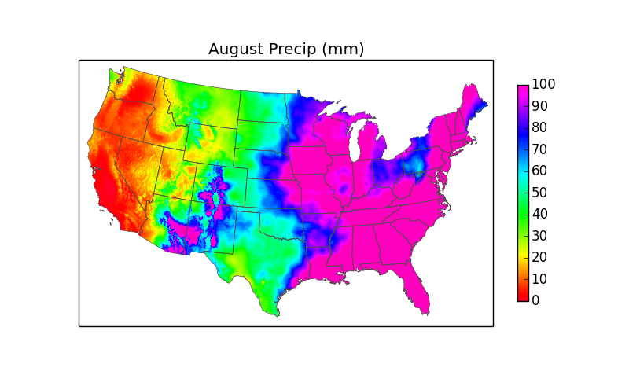
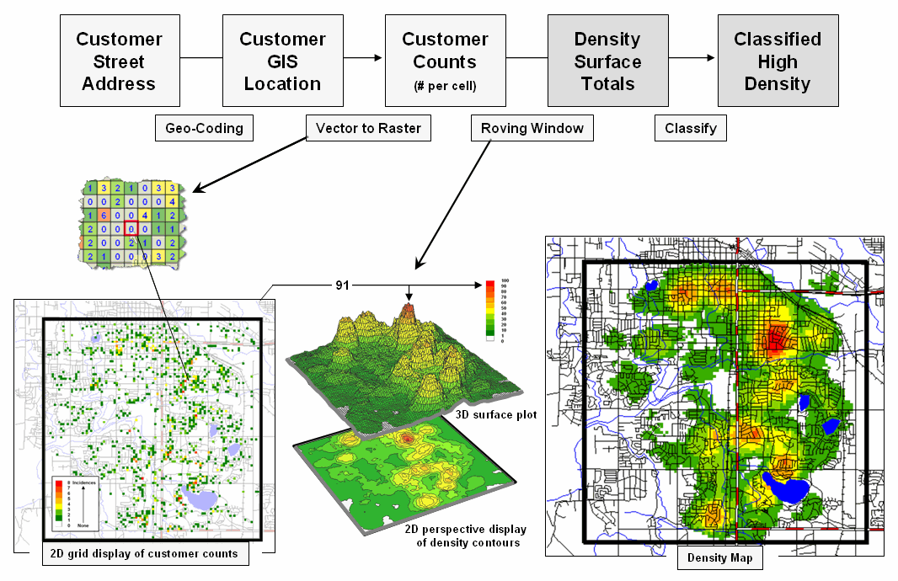
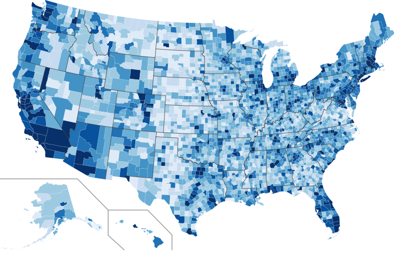
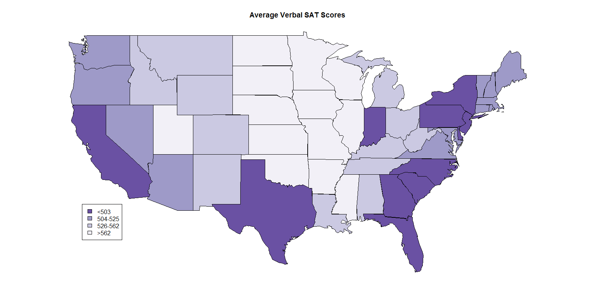
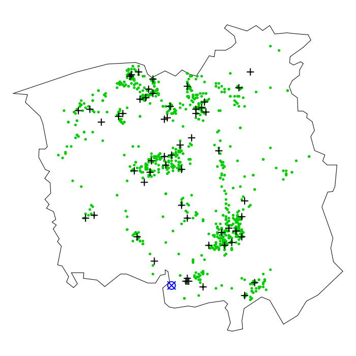
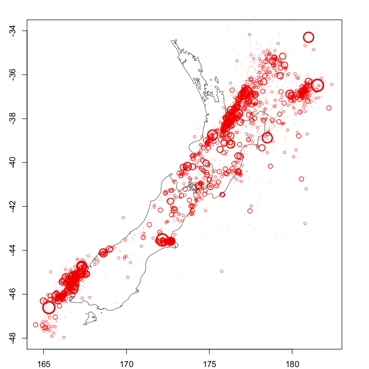

# Spatial Data Analysis

## Types of Spatial Data

Cressie's (1993) classification: Looks at the nature of the Spatial Domain

Consider a spatial process in $d$ dimensions:

$$
{Z(\mathbf{s}): \mathbf{s} \in D \subset \mathbf{R}^d}
$$

In this case $Z$ is the attribute we observe, for example:

-   Corn Yield
-   Ozone level (ppm)
-   Number of Influenza cases

$\mathbf{d}$ is the location where we observe $Z$. We can write it as a vector of size $(s\times 1)$. Usually $\mathbf{s}$ lies in a two dimensional space ($d=2$). This means $\mathbf{s}=(x,y)'$

The type of spatial data is linked to the nature of the domain D.

-   Geostatistical Data
-   Lattice, Regional or Areal Data
-   Point Pattern Data

**Geostatistical data**

-   Domain $D$ is continuous and fixed: $Z(\mathbf{s})$ can be observed anywhere within $D$ and points in $D$ are not stochastic.
-   Geostatistical data also called *spatial data with continuous variation*
-   Attribute $Z$ can be continuous or discrete
-   Since $D$ is continuous it can not be sampled everywhere. We normally have a set of points where $Z$ is measured.
-   An important goal of the statistical analysis is to reconstruct the surface of the $Z$ attribute to be able to map $Z(\mathbf{s})$

**Example 1: August precipitation**

{width="50%"}

**Example 2: Customer Density Surface**

{width="27%"}

**Lattice data, Regional or Areal data**

-   The domain $D$ is fixed and discrete.
-   The number of locations can be large but are countable
-   Examples are associated to attributes collected in regions, for example, by Zip code, census tract, remote sensing data reported by pixels.
-   Need to define a representative location for the region, for example, the centroid.
-   To calculate distances between regions, we need to adopt a convention, for example, distances between counties, are distances between their centroids.
-   Data is aggregated per regions: Examples: number of crimes reported by county; soil moisture associated to a pixel; yield measured on a farm, etc.

**Example 1: Spatial distribution of Twitter users based on a Streaming API sample**

{width="30%"}

**Example 2: Average Verbal SAT scores**

{width="20%"}

**Notation for Lattice data**

-   Very often the notation for lattice data is $Z(\mathbf{s}_i)$, which coincides with the notation of Geostatistics data.
-   The lattice data implies integration of a continuous spatial attribute, e.g., average corn yield per plot, or enumeration of a counting measure, e.g. number of children with elevated blood lead level per county for a particular state and year.
-   To emphasize the areal nature of the lattice data you could use the notation $Z(A_i)$, where $A_i$ is the *ith* areal unit. $A_i$ is called the spatial support of the data.
-   The aim of the analysis is very often to study the spatial patterns of the response of interest, as a function of other spatial factors.

**Point Patterns data**

-   While for Geostatistics and Areal Data the domain $D$ is static and fixed (it does not change from one realization of the process to the next) in Point pattern data the domain $D$ can change for the different realizations of the process. Example: Locations for lightning occurrence.
-   The importance of point pattern data is the random domain and not the nature of the attribute being measured. In this case we talk about **unmarked patterns.**
-   If in addition to the location of the process, we observed the stochastic intensity of the attribute $Z$, we can talk about a **marked pattern**.

**Example 1: Laryngeal cancer cases (black crosses) in the vicinity of an industrial incinerator (blue mark)**

{width="30%"}

**Example 2: Epicenters of earthquakes in New Zealand from January 2000 to May 2011. Circle sizes represent magnitude**

{width="30%"}

## Spatial Random Fields

**Spatial random fields**

-   A spatial random field is a collection of random variables indexed by some set $D \subset \mathtt{R}^2$ containing spatial coordinates $\mathbf{s}=[s_1,s_2,\ldots,s_d]'$.
-   We view the spatial data $Z(\mathbf{s})$ as a stochastic process. There is a random mechanism to generate the data.
-   If the dimension $d$ of the index set of the stochastic process is greater than one, the stochastic process is often referred to as a **random field**.
-   We will be mostly concerned with spatial processes in $\mathtt{R}^2$
-   A particular realization $\omega$ of this random mechanism, produces a surface $Z(.,\omega)$. Because the surface from which the samples are drawn is the result from this random experiment, $Z(\mathbf{s})$ is also referred as a **random function**
-   The collection of $n$ georeferenced spatial data do not represent a sample size of size $n$
-   They represent an incomplete observation of a single realization of a random experiment. This is a sample of size one from an n-dimensional distribution.
-   We can talk about $E[Z(\mathbf{s})]=\mu(\mathbf{s})$. This is the long run average of the attribute $Z$ at location $\mathbf{s}$
-   The expected value is taken over the distribution of all possible realizations $\omega$ of the random experiment.
-   How can we make progress in statistical inference with a sample of size one?
-   Normally we do not have replications of the spatial data in the sense of observing independent realizations of the process
-   Fortunately, we can make inference on the process by assuming certain stationarity assumptions

## Stationarity

**Strict Stationarity**

A random field $\{Z(\mathbf{s}): \mathbf{s} \in D \subset \mathtt{R}^d\}$ is called a strict (or strong) Stationary field if the spatial distribution is invariant under translation of the coordinates:

$$
Pr(Z(s_1)<z_1,Z(s_2)<z_2,\ldots,Z(s_k)<z_k)=
$$

$$
Pr(Z(s_1+\mathbf{h})<z_1,Z(s_2+\mathbf{h})<z_2,\ldots,Z(s_k+\mathbf{h})<z_k)
$$

for all $k$ and $\mathbf{h}$.

Since strict stationarity is a strong condition, and in many situations is enough to know the second order moments; it is not necessary to know the joint's data probability distribution.

**Second order (weak) Stationarity**

A random field $\{Z(\mathbf{s}): \mathbf{s} \cap D \subset \mathtt{R}^d\}$ is called a second order stationary if:

$$
E[Z(\mathbf{s})]=\mu
$$

and

$$
Cov[Z(\mathbf{s}), Z(\mathbf{s + h})]=C(\mathbf{h})
$$

The mean is constant and the covariance is only a function of the spatial separation $\mathbf{h}$ between the two locations.

### Covariance function

-   The function $C(\mathbf{h})$ is called the **Covariance Function**
-   $C(\mathbf{h})$ does not depend on the absolute coordinates
-   $$
    Cov[Z(\mathbf{s}), Z(\mathbf{s + 0})]=
    $$

$$
Cov[Z(\mathbf{s}), Z(\mathbf{s})]=C(\mathbf{0})
$$

This implies that the variability of a second order stationary random field is the same for any location.

**Please note**: Strict stationarity implies second order stationarity but the reverse is not true.

**Properties of the Covariance function**

Properties of the Covariance function of a second-order stationary random field:

-   $C(\mathbf{0})\geq 0$
-   $C(\mathbf{h})$=$C(-\mathbf{h})$
-   $C(\mathbf{0})\geq |C(\mathbf{h})|$
-   $C(\mathbf{h})=Cov[Z(\mathbf{s}),Z(\mathbf{s+h})]=Cov[Z(\mathbf{0}),Z(\mathbf{h})]$
-   If $C_j(\mathbf{h})$ are valid covariance functions, $j=1,\ldots,k$, then $\sum_{j=1}^k b_j C_j(\mathbf{h} )$ is a valid covariance function, if $b_j\geq 0$ $\forall j$
-   If $C_j(\mathbf{h})$ are valid covariance functions, $j=1,\ldots,k$, then $\prod_{j=1}^k C_j(\mathbf{h} )$ is a valid covariance function
-   If $C(\mathbf{h})$ is a valid covariance function in $\mathtt{R}^d$, then it is also a valid covariance function in $\mathtt{R}^p$, $p<d$

**Positive Definiteness conditions**

A covariance function $C(\mathbf{s_i-s_j})$ of a second-order stationary spatial random field in $\mathtt{R}^d$ is valid, if C satisfies the condition:

$$
\sum_{i=1}^k \sum_{j=1}^k a_ia_jC(\mathbf{s_i-s_j})\geq 0
$$

for any set of locations and real numbers. This is called the positive definiteness condition.

Note that this expression is the variance of the linear combination $\mathbf{a}^\intercal [Z(\mathbf{s_1}),Z(\mathbf{s_2}),\ldots,Z(\mathbf{s_k})]$. The condition follows from this fact.

### Intrinsic Stationarity

If $Z(\mathbf{s})$ is not a second-order stationary random field, but the increments are, the process is said to have **intrinsic stationarity**.

The process $\{Z(\mathbf{s}): \mathbf{s} \in D \subset \mathtt{R}^d\}$ is intrinsically stationary if $E[Z(\mathbf{s})] =\mu$ and

$$
\frac{1}{2}Var[Z(\mathbf{s})-Z(\mathbf{s+h})]=\gamma(\mathbf{h})
$$

The function $\gamma(\mathbf{h})$ is called the **semivariogram** of the spatial process.

-   It can be shown that the class of intrinsic stationary processes is larger than the second-order stationary processes (Cressie, 1993).
-   **Exercise**: Proof that a second order stationary process is also intrinsically stationary. The reverse is not true. For this is sufficient to examine: $Var[Z(\mathbf{s})-Z(\mathbf{s+h})]$
-   Because of the relationship $\gamma(\mathbf{h})=C(\mathbf{0})-C(\mathbf{h})$, statistical methods can be developed in terms of $\gamma(\mathbf{h})$ or $C(\mathbf{h})$.

### Isotropy

-   For a second order stationary process the covariance depends on the separation vector $\mathbf{h}$
-   The covariance function can depend on the direction
-   When the covariance does not depend on the direction but only on the absolute distance between two points $||\mathbf{h}||$, the covariance function is called **isotropic**
-   If the random field is second order stationary with an isotropic covariance function, then

$$
C(\mathbf{h})=C^*(|\mathbf{h}||)
$$

$||\mathbf{h}||$ is the euclidean distance $\sqrt{h_1^2+h_2^2}$. Also note that C and $C^*$ are different functions, but we normally use C.

## Gaussian Random Fields

A random field $\{Z(\mathbf{s}): \mathbf{s} \in D \subset \mathtt{R}^d\}$ is a Gaussian Random Field (GRF) if the cumulative distribution function

$$
Pr(Z(s_1)<z_1,Z(s_2)<z_2,\ldots,Z(s_k)<z_k)
$$

is a k-variate Normal distribution. This implies that each $Z(\mathbf{s_i})$ has a univariate Normal distribution.

The reverse is not true. This means that even if $Z(\mathbf{s_i}) \sim G(\mu(\mathbf{s_i}),\sigma^2(\mathbf{s_i}))$ the joint distribution of $Z(s_1),Z(s_2),\ldots,Z(s_k)$ is not necessarily a multivariate Normal distribution.

### Model Representation of a Random Field

-   The type of statistical model we will use is the mathematical representation of the data-generating mechanism with the following additive structure:

$$
Data = Structure + Error
$$

-   The structure is the large scale trend and the error represents the stochastic variation and covariation among responses.

Intrinsic and weak stationarity require $E[Z(\mathbf{s})]=\mu$. But normally the large-scale trend changes with location. Therefore: $E[Z(\mathbf{s})]=\mu(\mathbf{s})$

The stationarity will be associated with a detrended version of $Z(\mathbf{s})$:

$$
Z(\mathbf{s})-\mu(\mathbf{s})
$$

-   Normally the stationarity assumption is intended for the de-trended version of $Z(\mathbf{s})$.
-   Usually we consider:

$$
Z(\mathbf{s}) = f(\mathbf{X,s,\boldsymbol{\beta}}) + e(\mathbf{s})
$$

where $Z(\mathbf{s})=[Z(\mathbf{s}_1),Z(\mathbf{s}_2),\ldots,Z(\mathbf{s}_n)]$; $\mathbf{X}$ is a $(n\times p)$ matrix of covariates, $\boldsymbol{\beta}$ is a vector of parameters, and $e(\mathbf{s})$ is a random error vector with $\mathbf{0}$ mean and $Var[e(\mathbf{s})]=\Sigma(\theta)$.

-   The function $f$ might be non-linear. It can be represented as:

$$
f(\mathbf{X,s,\boldsymbol{\beta}})=
\begin{bmatrix}
f(x_1,\mathbf{s}_1,\boldsymbol{\beta})\\
f(x_2,\mathbf{s}_2,\boldsymbol{\beta})\\
\vdots\\
f(x_n,\mathbf{s}_n,\boldsymbol{\beta})
\end{bmatrix}
$$

-   It follows that $E[Z(\mathbf{s})]=f(\mathbf{X,s,\boldsymbol{\beta}})$. This is the large scale structure of the process.
-   Stationary assumption is meant for $e(\mathbf{s})$
-   The stationarity assumption is used to build the structure of $Var[e(\mathbf{s})]=\Sigma(\theta)$. The entries of this matrix can be built from the function $C(\mathbf{h})$ of a second order stationarity process.
-   The large scale structure can be expressed as a linear function of the spatial coordinates: $E[Z(\mathbf{s})]=\mathbf{X(s)}\boldsymbol{\beta}$. The matrix $\mathbf{X(s)}$ can involve other variables apart from the location.
-   The main parameters to be estimated are $\theta$ for the Covariance function and $\boldsymbol{\beta}$ for the large scale trend
-   Usually for spatial regression $\boldsymbol{\beta}$ has more importance and $\theta$ is considered a nuisance parameter
-   For spatial prediction, $\theta$ estimates are critical since they drive the mean square prediction error

Since the errors can contain more than a single component Cressie(1993) proposed the following decomposition:

$$
Z(\mathbf{s}) = \mu(\mathbf{s}) + W(\mathbf{s}) +\eta(\mathbf{s}) +\varepsilon(\mathbf{s})
$$

-   $\mu(\mathbf{s})$ is the **large scale trend**
-   $W(\mathbf{s})$ is the **smoothed-scale variation**: stationary process with covariance function $C_W(\mathbf{h})$. The range of the process is larger that the smallest distance between the observed data points.
-   $\eta(\mathbf{s})$ is the **micro-scale variation**: stationary process with range lower than the minimum distance between data points. The spatial structure of this process can not be estimated from the observed data. Maybe the variance $Var(\eta(\mathbf{s}))=\sigma_\eta^2$ could be estimated.
-   $\varepsilon(\mathbf{s})$ is a white noise measurement error with variance $Var(\varepsilon(\mathbf{s}))=\sigma_\varepsilon^2$

Usually $\sigma_\eta^2$ and $\sigma_\varepsilon^2$ can not be estimated in a separate form. One can consider the model:

$$
Z(\mathbf{s}) = \mu(\mathbf{s}) + W(\mathbf{s}) +e^*(\mathbf{s})
$$

where $e^*(\mathbf{s})= \eta(\mathbf{s})+\varepsilon(\mathbf{s})$

Since the three random components are assumed independent, the variance-covariance matrix of the process decomposes as:

$$
\Sigma(\theta)=\Sigma_W(\theta_W)+\Sigma_\eta(\theta_\eta)+\Sigma_\varepsilon(\theta_\varepsilon)
$$

## Covariance Estimation

Usually $\Sigma(\theta)$ is estimated using a parametric form for the continuous spatial autocorrelation among observations. Consider the model

$$
Z(\mathbf{s}) =\mathbf{X\boldsymbol{\beta}} + e(\mathbf{s})
$$

where $e(\mathbf{s}) \sim N(\mathbf{0, \Sigma(\theta)})$.

If $\theta$ is estimated from the data ($\hat{\theta}$) the estimated generalized least-square estimator for $\boldsymbol{\beta}$ is given by:

$$
\hat{\boldsymbol{\beta}}_{egls}=\mathbf{(X' \Sigma(\hat{\theta})X)^{-1}X' \Sigma(\hat{\theta})Z(\mathbf{s})}
$$

The estimator $\hat{\boldsymbol{\beta}}_{egls}$ is consistent if the parameter estimate \$ \hat{\theta}\$ is a consistent estimator.

**Covariance estimation and prediction**

Suppose our interest is in predicting the value of $Z(\mathbf{s}_0)$ at an unobserved location $\mathbf{s}_0$.

Suppose the spatial model is:

$$
Z(\mathbf{s}) = \mu\mathbf{1} + e(\mathbf{s})
$$

The best linear unbiased predictor (BLUP)(minimizes the mean square error) is:

$$
\hat{Z}(\mathbf{s}_0) =\hat{\mu}+c(\theta)' \Sigma(\theta)^{-1} (Z(\mathbf{s})-\mathbf{1}\hat{\mu})
$$

This is the **Ordinary Kriging estimator**, where $\hat{\mu}$ is the glse of $\mu$ and $c(\theta)=Cov[Z(\mathbf{s}_0),Z(\mathbf{\mathbf{s}})]$.

From this equation is important to conclude that the estimation of $c(\theta)$ and $\Sigma(\theta)$ "drives" the predicted value $\hat{Z}(\mathbf{s}_0)$.

**Semiovariogram and Covariogram**

The semivariogram is usually defined as:

$$
\gamma(\mathbf{h})=\frac{1}{2}Var[Z(\mathbf{s})-Z(\mathbf{s+h})]
$$

($2*\gamma(\textbf{h})$ is called the **variogram**).

If the spatial process is second-order stationary, the semivariogram can be expressed in terms of the covariance function $C(\mathbf{h})=C(\mathbf{s_i}-\mathbf{s_j})=C(Z(\mathbf{s_i}),Z(\mathbf{s_j}))$:

$$
\gamma(\mathbf{h})=C(\mathbf{0})-C(\mathbf{h})
$$

Note that: $\gamma(\mathbf{s_i-s_j}) \rightarrow C(\mathbf{0})$ when $C(\mathbf{s_i-s_j}) \rightarrow \mathbf{0}$. When the covariance is close to zero for certain distances, the semivariogram provides an estimate of the variance of the process.

The covariogram is referred to the graph of $C(\mathbf{h})$ as a function of $\mathbf{h}$

If we have observations $Z(\mathbf{s}_1),Z(\mathbf{s}_2),\ldots,Z(\mathbf{s}_k)$ from a spatial process with constant mean:

$$
\gamma(\mathbf{\mathbf{s}_i-\mathbf{s}_j})=\frac{1}{2}E[(Z(\mathbf{s})-Z(\mathbf{s+h}))^2]
$$

A simple moment based estimator is (Matheron, 1962):

$$
\hat{\gamma}(\mathbf{s}_i-\mathbf{s}_j)=\frac{1}{2|N(\mathbf{s}_i-\mathbf{s}_j)|}\sum_{N(\mathbf{s}_i-\mathbf{s}_j)} \{Z(\mathbf{s}_i)-Z(\mathbf{s}_j)\}^2
$$

where $N(\mathbf{s}_i-\mathbf{s}_j)$ is the set of locations with coordinates difference $\mathbf{s}_i-\mathbf{s}_j$ and $|N(\mathbf{s}_i-\mathbf{s}_j)|$ is the distinct number of pairs of points in this set.

A natural estimator is:

$$
\hat{C}(\mathbf{s}_i-\mathbf{s}_j)=\frac{1}{|N(\mathbf{s}_i-\mathbf{s}_j)|}\sum_{N(\mathbf{s}_i-\mathbf{s}_j)} (Z(\mathbf{s}_i)- \bar{Z})(Z(\mathbf{s}_j)-\bar{Z})
$$

where $\bar{Z} =\frac{1}{n}\sum_{i=1}^n Z(\mathbf{s}_i)$

-   If $Z(\mathbf{s})$ intrinsically stationary, $\hat{\gamma}(\mathbf{h})$ for $\mathbf{h=s_i-s_j}$ is an unbiased estimator of $\gamma(\mathbf{h})$.
-   It can be demonstrated that **(Exercise)**:

$$
\hat{\gamma}(\mathbf{h})\neq \hat{C}(\mathbf{0}) - \hat{C}(\mathbf{h})
$$

where $\hat{C}(\mathbf{0})=\frac{1}{n}\sum_{i=1}^n (Z(\mathbf{s}_i)-\bar{Z})^2$. In this case $\hat{C}(\mathbf{h})$ is a biased estimator.

### Maximum likelihood Estimation

Suppose we want to estimate the parameters of a Random Field with mean $\mu$ and variance-covariance matrix $\Sigma(\theta)$. We want to estimate $\mu$ and $\theta$. We need to assume a distribution for the random field.

Assuming a Gaussian model, let $Z(\mathbf{s})=[Z(s_1), Z(s_2),\ldots, Z(s_n)]$ and $Z(\mathbf{s}) \sim G(\mu \mathsf{1},\Sigma(\theta))$

We need to minimize the following expression of the -2log-likelihood with respect to $\mu$ and $\theta$:

$$
\phi(\mu,\theta;Z(\mathbf{s}))= \ln(|\Sigma(\theta)|)+n\log(2\pi) +
$$

$$
+ (Z(\mathbf{s}) - \mu \mathsf{1})^{'} \Sigma(\theta)^{-1} (Z(\mathbf{s}) - \mu \mathsf{1})
$$

**Restricted Maximum likelihood Estimation**

The maximum likelihood estimators might be biased because it does not allow to make allowances for the loss of degrees of freedom due to the mean parameter estimation. The idea of RMLE is to estimate the variance-covariance matrix parameters by maximizing the likelihood of $K Z(\mathbf{s})$, where $K$ is a matrix such that $E[K Z(\mathbf{s})]=0$

The function of the matrix $K$ is to *take out the mean*.

The matrix $K$ is not unique, but this is not a problem. A simple choice can be the $(n-1)\times n$ matrix:

$$
\begin{bmatrix}
1-\frac{1}{n} &-\frac{1}{n}& \hdots& -\frac{1}{n} \\
-\frac{1}{n} & 1-\frac{1}{n} &  \hdots& -\frac{1}{n}\\
\vdots & \vdots &\vdots & \vdots\\
-\frac{1}{n} & -\frac{1}{n}& \hdots & 1-\frac{1}{n}
\end{bmatrix}
$$

In this case $K Z(\mathbf{s})$ is the $(n-1)\times 1$ vector of differences from the sample mean.

In this case:

$$
K Z(\mathbf{s}) \sim G(0,K\Sigma(\theta) K^{'})
$$

and the -2 restricted log-likelihood becomes:

$$
\phi(\mu,\theta;KZ(\mathbf{s}))= \ln(|K\Sigma(\theta)K^{'}|)+(n-1)\log(2\pi) +
$$

$$
+ Z(\mathbf{s})^{'}K^{'}(K \Sigma(\theta)K^{'})^{-1} K Z(\mathbf{s})
$$

## Model Based Geostatistics

### Estimation vs. Prediction

Assume a Random field with model representation:

$$
Z(\mathbf{s})=X(\mathbf{s})\boldsymbol{\beta}  + e(\mathbf{s}), \;\;e(\mathbf{s}) \sim N(\mathbf{0}, \Sigma)
$$

-   Estimation: $E[Z(\mathbf{s})]=X(\mathbf{s})\boldsymbol{\beta}$
-   Prediction: $\hat{Z}(\mathbf{s_0})$

**Geostatistical prediction**

Kriging: Statistical tools for predicting $g(Z(\mathbf{s_0}))$ from a set of observed data.

-   Term coined by Matheron in honor of the South African mining engineer D.G. Krige for his work on ore-grade estimation (Krige, 1951).
-   Other important sources: Gandin, 1963; Chil\`es and Delfiner, 1999; Deutsh and Journel, 1992; Cressie, 1993

**Functions for prediction**

The function $g(Z(\mathbf{s_0}))$ can have several forms

-   The identity function: Predicting the process itself: $g(Z(\mathbf{s_0}))=Z(\mathbf{s_0})$
-   Predicting the Average in a region B of volume $|B|$:

$$
g(Z(B))=\frac{1}{|B|}\int _B Z(\mathbf{u}) d\mathbf{u}
$$

-   Predicting a binary variable indicating whether $Z(\mathbf{s})$ exceeds a certain threshold $c$:

$$
g(Z(\mathbf{s_0}))=\left \{\begin{array}{cc}
1 & Z(\mathbf{s_0}) >c \\
0 & Z(\mathbf{s_0}) \leq c
\end{array} \right .
$$

**Loss function**

Let $p(Z; \mathbf{s_0})$ denote the predictor of $Z(\mathbf{s_0})$.

We need to define a function $L(Z(\mathbf{s_0}),p(Z; \mathbf{s_0}))$ that measures the loss of estimating $Z(\mathbf{s_0})$ by $p(Z; \mathbf{s_0})$. This function is the *square error loss function*:

$$
L(Z(\mathbf{s_0}),p(Z; \mathbf{s_0})) = (Z(\mathbf{s_0})-p(Z; \mathbf{s_0}))^2
$$

Under the square-error loss, the average loss is simply the mean square prediction error (MSPE) of using $p(Z; \mathbf{s_0})$ as a predictor of $Z(\mathbf{s_0})$

**Mean square prediction error**

$$
E[(Z(\mathbf{s_0})-p(Z; \mathbf{s_0}))^2]= MSE[p(Z; \mathbf{s_0});Z(\mathbf{s_0})]
$$

The predictor that minimizes the mean square error is the conditional expectation given the observed data $Z(\mathbf{s})=(Z(\mathbf{s_1}), Z(\mathbf{s_2}),\ldots, Z(\mathbf{s_n}))$:

$$
p^0(Z; \mathbf{s_0})=E[Z(\mathbf{s_0})|Z(\mathbf{s})]
$$

$p^0(Z; \mathbf{s_0})$ is an unbiased estimator, in the sense that $E[p^0(Z; \mathbf{s_0})]=E[Z(\mathbf{s_0})]$

**Gaussian case**

Consider a partition of $(n\times 1)$ vector W: $W=[U,V]$, where $U$ has dimension $(u\times 1)$ and $V$ has dimensions $((n-u)\times 1)$.

$$
E[W]=E\begin{bmatrix} U \\ V \end{bmatrix}=\begin{bmatrix} \mu_u \\ \mu_v \end{bmatrix}
$$

$$
Var[W]=\begin{bmatrix}
\Sigma_u & \Sigma_{uv}\\
\Sigma_{uv}^{' }& \Sigma_{v}
\end{bmatrix}
$$

If $W$ is Gaussian:

$$
E[U|V]=\mu_u+\Sigma_{uv} \Sigma_{v}^{-1} (V-\mu_v)
$$

$$
Var[U|V]=\Sigma_u-\Sigma_{uv} \Sigma_{v}^{-1}\Sigma_{uv}^{'}
$$

**Conditional mean in a Gaussian random field**

Assume $Z(\mathbf{s_0})$ and $Z(\mathbf{s})$ have a jointly multivariate Gaussian distribution with

$$
E[Z(\mathbf{s_0})]=\mu(\mathbf{s_0})
$$

$$
Cov[Z(\mathbf{s}), Z(\mathbf{s_0})]=\boldsymbol{\sigma}
$$

$$
Var[Z(\mathbf{s})]=\Sigma
$$

$$
E[Z(\mathbf{s})]=\mu(\mathbf{s})
$$

Using the previous result:

$$
E[Z(\mathbf{s_0})|Z(\mathbf{s})]=\mu(\mathbf{s_0})+\boldsymbol{\sigma}^{'}\Sigma^{-1}(Z(\mathbf{s})-\mu(\mathbf{s}))
$$

This conditional expectation is linear in the observations

**Conditional variance in a Gaussian random field**

Using the square-error loss, the conditional mean is the best predictor.

The mean square prediction error can be written as:

$$
E[(Z(\mathbf{s_0})-p^0(Z; \mathbf{s_0}))^2] =Var[Z(\mathbf{s_0})]-Var[p^0(Z; \mathbf{s_0})]
$$

For a Gaussian Random Field:

$$
E[(Z(\mathbf{s_0})-p^0(Z; \mathbf{s_0}))^2] =Var[Z(\mathbf{s_0})]-\boldsymbol{\sigma^{'}} \Sigma ^{-1} \boldsymbol{\sigma}
$$

Note that the first equation says that the variation of the best predictor under the squared-error loss should be smaller than the variation of the of the random field itself!

### Simple Kriging

In the Simple Kriging case, **the mean of the random field is assumed as known**.

The goal is to find a linear predictor of $Z(\mathbf{s_0})$, $p(Z; \mathbf{s_0})$ that minimizes $E[(Z(\mathbf{s_0})-p(Z; \mathbf{s_0}))^2]$

A linear predictor of the form:

$$
p(Z; \mathbf{s_0})=\lambda_0 + \boldsymbol{\lambda }^{'} Z(\mathbf{s})
$$

is considered. The values of $\lambda_0$ and $\boldsymbol{\lambda}=(\lambda_1,\lambda_2,\ldots,\lambda_n)$ are unknown and need to be estimated.

We want to minimize $E[(p(Z;\mathbf{s_0})-Z(\mathbf{s_0}))^2]$ with respect to $\lambda_0$ and $\bm{\lambda}$

After differentiating and equating to zero, the optimal choices for $\lambda_0$ and $\boldsymbol{\lambda}$ are given by:

$$
\begin{aligned}
\lambda_0 =& \mu(\mathbf{s_0})-\boldsymbol{\lambda}^{'}\mu(\mathbf{s})\\
\boldsymbol{\lambda} =&\Sigma^{-1} \boldsymbol{\sigma}
\end{aligned}
$$

The optimal linear predictor becomes:

$$
p_{sk}(Z; \mathbf{s_0})=\lambda_0 + \boldsymbol{\lambda} ^{'} Z(\mathbf{s})=\mu(\mathbf{s_0})+\boldsymbol{\sigma}^{'}\Sigma^{-1}(Z(\mathbf{s})-\boldsymbol{\mu}(\mathbf{s}))
$$

This is called the *simple kriging predictor*.

### Simple Kriging Variance

In order to calculate the Kriging Variance we need to calculate:

$$
E[(p(Z;\mathbf{s_0})-Z(\mathbf{s_0}))^2]=E[(\lambda_0+\bm{\lambda}' Z(\mathbf{s}) -Z(\mathbf{s_0}))^2]
$$

This results in the expression:

$$
E[(p(Z;\mathbf{s_0})-Z(\mathbf{s_0}))^2]=Var[\bm{\lambda}'Z(\mathbf{s})-Z(\mathbf{s_0})] +(\lambda_0+\bm{\lambda}'\mu(\mathbf{s})-\mu(\mathbf{s_0}))
$$

After substituting $\lambda_0$ in this expression, the last term in the right hand side is zero.

When substituting $\bm{\lambda}' = \bm{\sigma'}\Sigma^{-1}$ into the variance expression for the mean-square error above:

$$
Var[\bm{\lambda}' Z(\mathbf{s})-Z(\mathbf{s_0})]=\sigma^2 + \bm{\lambda}' \Sigma \bm{\lambda} -2\bm{\sigma'}\bm{\lambda}
$$

we get the simple Kriging Variance:

$$
\sigma^2_{sk}=\sigma^2 -\bm{\sigma'} \Sigma ^{-1} \bm{\sigma}
$$

**Simple Kriging: Exact Interpolator**

If we take the equation:

$$
p_{sk}(Z; \mathbf{s_0})=\lambda_0 + \bm{\lambda} ^{'} Z(\mathbf{s})=\mu(\mathbf{s_0})+\bm{\sigma}^{'}\Sigma^{-1}(Z(\mathbf{s})-\mu(\mathbf{s}))
$$

and substitute $\mathbf{s_0}$ by $\mathbf{s_1,s_2,\ldots,s_n}$, and replace: $Cov[Z(\mathbf{s_0}),Z(\mathbf{s})]=\bm{\sigma}'$ by $Cov[Z(\mathbf{s}),Z(\mathbf{s})]=\Sigma$ and $\mu(\mathbf{s_0})$ by $\mu(\mathbf{s})$ we obtain:

$$
p_{sk}(Z; [\mathbf{s_1,s_2,\ldots,s_n}])=\mu(\mathbf{s})+\Sigma\Sigma^{-1}(Z(\mathbf{s})-\mu(\mathbf{s}))=Z(\mathbf{s})
$$

-   The property of being an exact interpolator is a desirable one.
-   But if the process contains a nugget effect and the nugget effect includes a measurement error, we might not want the predictor to interpolate the data.

### Ordinary Kriging

With the simple Kriging predictor the mean of the process is assumed to be known. It can change for every location.

**With Ordinary Kriging the mean is unknown but constant**: $E[Z(\mathbf{s})]=\mu \mathbf{1}$. Ordinary Kriging is the beast linear unbiased predictor (BLUP) under the square-error loss.

The predictor $p(Z;\mathbf{s_0})$ of $Z(\mathbf{s_0})$ minimizes

$$
E[(p(Z;\mathbf{s_0})-Z(\mathbf{s_0}))^2]
$$

for a model of the form:

$$
Z(\mathbf{s})=\mu\mathbf{1} + e(\mathbf{s}), \;\; e(\mathbf{s})\sim (\mathbf{0},\Sigma)
$$

Again we consider predictors of the form:

$$
p(Z; \mathbf{s_0})=\lambda_0 + \bm{\lambda}^{'} Z(\mathbf{s})
$$

where $\lambda_0$ and the elements of vector $\bm{\lambda}$ are unknown coefficients to be determined.

From previous developments we can assume: $\lambda_0=\mu-\bm{\lambda}' \mu \mathbf{1}$. We can not determine $\lambda_0$ because we do not know $\mu$.

We can include the condition $E[Z(\mathbf{s_0})]=\mu$. For unbiasedness we require: $E[p(Z;\mathbf{s_0})]=E[Z(\mathbf{s_0})]$ or equivalently: $E[\lambda_0 + \bm{\lambda} ^{'} Z(\mathbf{s})]=E[Z(\mathbf{s_0})]$. This implies $\lambda_0+\mu(\bm{\lambda}' \mathbf{1}-1)=0$

This condition must hold for every $\mu$. For $\mu=0$ the constraint requires $\lambda_0$ =0 and $\bm{\lambda}' \mathbf{1}=1$.

The problem reduces to choose weights $\bm{\lambda}=[\lambda_1,\dots,\lambda_n]'$ that minimize

$$
E[(\bm{\lambda}'Z(\mathbf{s})-Z(\mathbf{s_0}))^2]
$$

subject to $\bm{\lambda}'\mathbf{1}=1$ This problem can be accomplished as an unconstrained minimization problem using Lagrange multipliers, by minimizing

$$
Q=E[(\bm{\lambda}'Z(\mathbf{s})-Z(\mathbf{s_0}))^2]-2m(\bm{\lambda}'\mathbf{1}-1)
$$

with respect to $\bm{\lambda}$ and $m$. (The 2 in the equation makes calculations easier)

After expanding the previous equation, and setting $Var[Z(\mathbf{s_0})]=\sigma^2=C(\mathbf{0})$ and assuming second-order stationarity, $Q$ can be written as:

$$
Q=C(\mathbf{0})+\bm{\lambda}'\Sigma \bm{\lambda} -2 \bm{\lambda}'\bm{\sigma}-2m(\bm{\lambda}'\mathbf{1}-1)
$$

Taking derivatives with respect to $\bm{\lambda}$ and $m$ and setting the resulting equations to zero we get:

$$
\begin{aligned}
\frac{\partial Q}{\partial \bm{\lambda}}= & 2\Sigma \bm{\lambda} -2\bm{\sigma} -2m\mathbf{1}=0\\
\frac{\partial Q}{\partial m}= & -2 (\bm{\lambda}'\mathbf{1}-1)=0
\end{aligned}
$$

The solutions to this problem are:

$$
\begin{aligned}
\bm{\lambda}'=& (\bm{\sigma} + \mathbf{1}\frac{1-\mathbf{1}'\Sigma^{-1}\bm{\sigma}}{\mathbf{1}'\Sigma^{-1}\mathbf{1}})' \Sigma^{-1}\\
m=& \frac{1-\mathbf{1}'\Sigma^{-1}\bm{\sigma}}{\mathbf{1}'\Sigma^{-1}\mathbf{1}}
\end{aligned}
$$

### Ordinary Kriging Variance

From Cressie (1993)

$$
\sigma^2_{ok}(\mathbf{s_0}) =C(\mathbf{0})-\bm{\sigma}'\Sigma^{-1}\bm{\sigma} + \frac{(1-\mathbf{1}'\Sigma^{-1}\bm{\sigma})^2}{\mathbf{1}'\Sigma^{-1}\mathbf{1}}
$$

Note that $\sigma^2_{sk}<\sigma^2_{ok}$ since the last term in the right hand side is positive.

**Another formulation of the Ordinary Kriging Predictor**

Best formulation of the Ordinary Kriging Predictor:

$$
p_{ok}(Z;\mathbf{s_0})=\hat{\mu}+\bm{\sigma}' \Sigma^{-1}(Z(\mathbf{s})-\mathbf{1}\hat{\mu})
$$

where $\mu$ should be estimated by the generalized least square estimator:

$$
\hat{\mu}=(\mathbf{1}'\Sigma^{-1}\mathbf{1})^{-1} \mathbf{1}'\Sigma^{-1} Z(\mathbf{s})
$$

This formulation makes the connection with the Gaussian random field best predictor.

**Ordinary Kriging in terms of the semivariogram**

-   The kriging equations can also be expressed in terms of the semivariogram of the process.
-   This is helpful for processes that are intrinsically stationary but not second order stationary.
-   It is necessary to use the matrix $\Gamma=[\gamma(\mathbf{s_i -s_j})]$ and the vector $\gamma(\mathbf{s_0})=[\gamma(\mathbf{s_0-s_1}),\hdots,\gamma(\mathbf{s_0-s_n})]$

### Ordinary Kriging in terms of the semivariogram

In this case we need to minimize:

$$
Q=-\bm{\lambda}^{'} \Gamma \bm{\lambda} +2 \bm{\lambda}^{'} \gamma(\mathbf{s_0}) -2m(\bm{\gamma}^{'} \mathbf{1} - 1)
$$

Differentiating with respect to $\bm{\lambda}$ and $m$ we get:

$$
\begin{aligned}
\bm{\lambda}'=& (\gamma(\mathbf{s_0})+ \mathbf{1}\frac{1-\mathbf{1}'\Gamma^{-1}\gamma(\mathbf{s_0})}{\mathbf{1}'\Gamma^{-1}\mathbf{1}})' \Gamma^{-1}\\
m=& \frac{1-\mathbf{1}'\Gamma^{-1}\gamma(\mathbf{s_0})}{\mathbf{1}'\Gamma^{-1}\mathbf{1}}
\end{aligned}
$$

The predictor and Kriging variance can be written as:

$$
\begin{aligned}
p_{ok}(Z;\mathbf{s_0})=& \bm{\lambda}^{'} Z(\mathbf{s})\\
\sigma_{ok}^2=& \bm{\lambda}^{'} \gamma(\mathbf{s_0}) + m =2\bm{\lambda}^{'} \gamma(\mathbf{s_0}) -\bm{\lambda}^{'}\Gamma \bm{\lambda}
\end{aligned}
$$

Note: The ordinary kriging predictor at location $\mathbf{s_0}$ depends on weights $\bm{\lambda}$ and they depend on the variance-covariance matrix $\Sigma=Var[Z(\mathbf{s})]$ and $Cov[Z(\mathbf{s_0}),Z(\mathbf{s})]$. These are the two *driving forces* of the process, and they have great impact on ordinary (and simple) kriging predictions.

### Universal Kriging

We have data $Z(\mathbf{s_1}),Z(\mathbf{s_2})\hdots,Z(\mathbf{s_n})$ and we want to predict at location $Z(\mathbf{s_0})$. The form of the general linear model for the data and the unobservables is:

$$
\begin{aligned}
Z(\mathbf{s})=& X(\mathbf{s}) \bm{\beta} + e(\mathbf{s})\\
Z(\mathbf{s_0})=& x(\mathbf{s_0})' \bm{\beta} + e(\mathbf{s_0})
\end{aligned}
$$

$x(\mathbf{s_0})$ is the \$ p\times 1\$ vector of explanatory values associated with location $\mathbf{s_0}$.

We assume a general variance-covariance matrix, $Var[Z(\mathbf{s})]=\Sigma$; a covariance between the data and the unobservable $Cov[Z(\mathbf{s}),Z(\mathbf{s_0})]=\bm{\sigma}$ (an $(n\times 1)$ vector), and $Var[Z(\mathbf{s_0})]=\sigma_0^2$.

The goal is to find the optimal linear predictor, unbiased and with minimum variance. Consider predictors of the form:

$$
\mathbf{a}' Z(\mathbf{s})
$$

The problem reduces to find the vector $\mathbf{a}$ that minimizes:

$$
E[(\mathbf{a}' Z(\mathbf{s})-Z(\mathbf{s_0}))^2]
$$

We want to minimize:

$$
E[(\mathbf{a}' Z(\mathbf{s})-Z(\mathbf{s_0}))^2]= Var[\mathbf{a}' Z(\mathbf{s})]+Var[Z(\mathbf{s_0})]-2Cov[\mathbf{a}' Z(\mathbf{s}),Z(\mathbf{s_0})]=
$$

$$
= \mathbf{a}'\Sigma \mathbf{a} + \sigma_0 -2 \mathbf{a}'\bm{\sigma}
$$

subject to $E[\mathbf{a}' Z(\mathbf{s})]=E[Z(\mathbf{s_0})]$. This condition implies:

$$
\mathbf{a}'X(\mathbf{s}) \bm{\beta}=x(\mathbf{s_0})' \bm{\beta}
$$

or

$$
\mathbf{a}'X(\mathbf{s})=x(\mathbf{s_0})'
$$

Again, one can use the Lagrange multiplier method and minimize:

$$
\mathcal{L}=\mathbf{a}'\Sigma \mathbf{a} + \sigma_0 -2 \mathbf{a}'\bm{\sigma} + 2 \mathbf{m}' (X(\mathbf{s})'\mathbf{a}-x(\mathbf{s_0}))
$$

$\mathbf{m}$ is a $p\times 1$ vector of Lagrange multipliers.

After differentiating $\mathcal{L}$ with respect to $\mathbf{a}$ and $\mathbf{m}$ we get:

$$
\begin{aligned}
\frac{\partial \mathcal{L}}{\partial \mathbf{a}} =& 2\Sigma \mathbf{a} -2\bm{\sigma} + 2 X(\mathbf{s}) \mathbf{m}\\
\frac{\partial \mathcal{L}}{\partial \mathbf{m}} =& 2(X(\mathbf{s})'\mathbf{a} -x(\mathbf{s_0}))
\end{aligned}
$$

After equating to zero and reorganizing terms we get the optimal solutions for $\mathbf{a}$ and $\mathbf{m}$.

We get the best linear predictor as:

$$
\mathbf{a}' Z(\mathbf{s}) = p_{uk}(Z;\mathbf{s_0})=
x(\mathbf{s_0})'\hat{\bm{\beta}}_{gls} +\bm{\sigma}'\Sigma^{-1} (Z(\mathbf{s})-X(s)\hat{\bm{\beta}}_{gls})
$$

where $\hat{\bm{\beta}}_{gls}$ is the generalized least square estimator of $\beta$:

$$
\hat{\bm{\beta}}_{gls}=(X(\mathbf{s})'\Sigma^{-1} X(\mathbf{s}))^{-1}X(\mathbf{s})'\Sigma^{-1} Z(\mathbf{s})
$$

If we assume a constant mean $E[Z(\mathbf{s})]=\mathbf{1}\mu$ the universal kriging predictor becomes:

$$
p_{ok}(Z;\mathbf{s_0})=\mathbf{1}\hat{\bm{\beta}}_{gls} +\bm{\sigma}'\Sigma^{-1} (Z(\mathbf{s})-\mathbf{1}\hat{\bm{\beta}}_{gls})
$$

with

$$
\hat{\bm{\beta}}_{gls}=(\mathbf{1}'\Sigma^{-1} \mathbf{1})^{-1}\mathbf{1}'\Sigma^{-1} Z(\mathbf{s})
$$

### Indicator Kriging

Assume that the process $\{ Z(\mathbf{s}): \mathbf{s} \in D \subset \mathsf{R}^n\}$ is strictly stationary. Consider the Indicator transform $Z(\mathbf{s})$

$$
I(\mathbf{s},z)=\left \{ \begin{array}{cc}
1 & if\; Z(\mathbf{s})\leq z\\
0 & \mbox{otherwise}
\end{array}
\right.
$$

The function transforms $Z(\mathbf{s})$ into a binary process, whose values are determined by $z$.

Since $E[I(\mathbf{s_0},z)]= Pr[Z(\mathbf{s_0})\leq z]=F(z)$ is unknown, we can use ordinary kriging to predict $I(\mathbf{s_0},z)$ from the indicator data $I(\mathbf{s},z)=[I(\mathbf{s_1},z), I(\mathbf{s_2},z),\hdots,I(\mathbf{s_n},z)]'$

The Indicator kriging estimator becomes:

$$
p_{ik}(I(\mathbf{s},z); I(\mathbf{s_0},z)=\bm{\lambda}(z) I(\mathbf{s},z)
$$

where $\bm{\lambda}$ is obtained from the ordinary kriging equations as a function of the semivariogram. In this case the indicator semivariogram is used:

$$
\gamma_I(\textbf{h})=\frac{1}{2} Var[I(\textbf{s+h},z)-I(\textbf{s},z)]
$$

-   Ordinary kriging provides an estimate to $E[Z(\mathbf{s_0} )|Z(\mathbf{s_1}), Z(\mathbf{s_2}),\hdots, Z(\mathbf{s_n})]$
-   Indicator kriging provides an approximation to: $E[I(\mathbf{s_0},z )|I(\mathbf{s_1},z), I(\mathbf{s_2},z),\hdots, I(\mathbf{s_n},z)]=Pr[Z(\mathbf{s})\leq z|I(\mathbf{s_1},z), I(\mathbf{s_2},z),\hdots, I(\mathbf{s_n},z)]$

Note that: $Pr[Z(\mathbf{s})\leq z|I(\mathbf{s_1},z), I(\mathbf{s_2},z),\hdots, I(\mathbf{s_n},z)]$ is not the same as: $Pr[Z(\mathbf{s})\leq z|Z(\mathbf{s_1}),Z(\mathbf{s_2})\hdots,Z(\mathbf{s_n})]$, therefore considerable information is lost when applying the indicator function. In practice the Indicator Kriging is a raw estimator of the conditional probability of interest.

However, the indicator semivariogram provides information about the bivariate probability distribution, since

$$
Var[I(\mathbf{s+h},z)-I(\mathbf{s},z)]=Pr[Z(\mathbf{s+h})\leq z,Z(\mathbf{s}) \leq z]
$$

Indicator Kriging is also used to provide a nonparametric prediction of any functional $g(Z(\mathbf{s_0}))$, by using $K$ different indicator variables defined at thresholds: $z_k; k=1,\hdots,K$. This produces an estimate of the entire conditional probability distribution at each location $\mathbf{s_0}$

### Disjunctive Kriging

This method proposed by Matheron (1967) for non-linear spatial prediction is based on a technique called *disjunctive coding*.

Let $\{\mathsf{R}_k\}$ be a partition of $\mathcal{R}$ such that \$ \mathsf{R}\_i \cap \mathsf{R}\_j=\emptyset\$ for $i\neq j$ and $\cup_k \mathsf{R}_k=\mathcal{R}$.

Define the indicator variables:

$$
I_k(\mathbf{s})=\left \{ \begin{array}{cc}
1 & if\; Z(\mathbf{s})\in \mathsf{R}_k\\
0 & \mbox{otherwise}
\end{array}
\right.
$$

If the partition is sufficiently fine (many subsets $\mathsf{R}_k)$, then any function $g(Z(\mathbf{s_0}))$, can be approximated by a linear combination of these indicator functions:

$$
g(Z(\mathbf{s_0}))=g_1 I_1(\mathbf{s_0}) + g_2 I_2(\mathbf{s_0}) + g_3 I_3(\mathbf{s_0}) + \ldots
$$

Each $I_k(\mathbf{s_0})$ is unknown but can be estimated using indicator kriging of the data associated with the $k^{th}$ set $\{I_k(\mathbf{s_i}), i=1,\ldots, n\}$. Using data from the other data sets is possible to have an optimal predictor of the form:

$$
\hat{I}_k(\mathbf{s_0})=\sum_i \sum_k \lambda_{ik} I_k(\mathbf{s_i})
$$

The predictor of $g(Z(\mathbf{s_0}))$ is given by

$$
p(Z,g(Z(\mathbf{s_0})))=\sum_i \sum_k g_{ik} I_k(\mathbf{s_i})=\sum_i g_i(Z(\mathbf{s_i}))
$$

The key of disjunctive kriging is to determine the functions $g_i(Z(\mathbf{s_i}))$. These functions are based on expansions of other functions that are uncorrelated.

## Multivariate Smoothing Spline

## Summary
